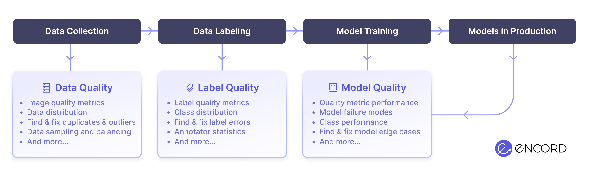

<p align="center">
<a href="https://encord-active-docs.web.app" target="_blank">Documentation</a> |
<a href="https://colab.research.google.com/drive/11iZE1CCFIGlkWdTmhf5XACDojtGeIRGS?usp=sharing" target="_blank">Try it Now</a> |
<a href="https://encord.com/encord_active/" target="_blank">Website</a> |
<a href="https://encord.com/blog/" target="_blank">Blog</a> |
<a href="https://join.slack.com/t/encordactive/shared_invite/zt-1hc2vqur9-Fzj1EEAHoqu91sZ0CX0A7Q" target="_blank">Slack Community</a>
</p>

<h1 align="center">
  <p align="center">Encord Active</p>
  <a href="https://encord.com"></a>
</h1>

[![PRs-Welcome][contribute-image]][contribute-url]
![Licence][license-image]
[![PyPi project][pypi-package-image]][pypi-package]
![PyPi version][pypi-version-image]
[![Open In Colab][colab-image]][colab-notebook]

[![docs][docs-image]][encord-active-docs]
[!["Join us on Slack"][slack-image]][join-slack]
[![Twitter Follow][twitter-image]][twitter-url]

## ❓ What is Encord Active?

[Encord Active][encord-active-landing] is an open-source active learning tookit that helps you find failure modes in your models and improve your data quality and model performance.

Use Encord Active to visualize your data, evaluate your models, surface model failure modes, find labeling mistakes, prioritize high-value data for re-labeling and more!


## 💡 When to use Encord Active?

Encord Active helps you understand and improve your data, labels, and models at all stages of your computer vision journey.

Whether you've just started collecting data, labeled your first batch of samples, or have multiple models in production, Encord Active can help you.



## 🔖 Documentation

Our full documentation is available [here](https://encord-active-docs.web.app). In particular we recommend checking out:

- [Getting Started](https://encord-active-docs.web.app/)
- [Workflows][encord-active-docs-workflow]
- [Tutorials](https://encord-active-docs.web.app/category/tutorials)
- [CLI Documentation](https://encord-active-docs.web.app/category/command-line-interface)

## Installation

The simplest way to install the CLI is using `pip` in a suitable virtual environment:

```shell
pip install encord-active
```

We recommend using a virtual environment, such as `venv`:

```shell
python3.9 -m venv ea-venv
source ea-venv/bin/activate
pip install encord-active
```

> `encord-active` requires [python3.9][python-39].
> If you have trouble installing `encord-active`, you find more detailed instructions on
> installing it [here][encord-active-docs].

## 👋 Quickstart

Get started immediately by sourcing your environment and running the code below.
This downloads a small dataset and launches the Encord Active App for you to explore:

```shell
encord-active quickstart
```

After opening the UI, we recommend you to head to the [workflow documentation][encord-active-docs-workflow] to see some common workflows.

## ⬇️  Download a sandbox dataset

Another way to start quickly is by downloading an existing dataset from the sandbox.
The download command will ask which pre-built dataset to use and will download it into a new directory in the current working directory.

```shell
encord-active download
cd /path/of/downloaded/project
encord-active visualise
```

The app should then open in the browser.
If not, navigate to [`localhost:8501`](http://localhost:8501).
Our [docs][encord-active-docs] contains more information about what you can see in the page.

##  Import your dataset

### Quick import Dataset

To import your data (without labels) save your data in a directory and run the command:

```shell
# within venv
encord-active init /path/to/data/directory
```

A project will be created using the data in the directory.

To visualise the project run:

```shell
cd /path/to/project
encord-active visualise
```

You can find more details on the `init` command in the [CLI documentation][encord-active-docs-init].

### Import from COCO

To import your data, labels, and predictions from COCO, save your data in a directory and run the command:

```shell
# install COCO extras
(ea-venv)$ python -m pip install encord-active[coco]

# import samples with COCO annotaions
encord-active import project --coco -i ./images -a ./annotations.json

# import COCO model predictions
encord-active import predictions --coco results.json
```

### Import from Encord Platform

This section requires [setting up an ssh key][encord-docs-ssh] with Encord, so slightly more technical.

> If you haven't set up an ssh key with Encord, you can follow the tutorial in [this link][encord-docs-ssh].

To import an Encord project, use this command:

```shell
encord-active import project
```

The command will allow you to search through your Encord projects and choose which one to import.

### Other options

> There are also options for importing projects from, e.g,. KITTI and CVAT. Find more details in [the documentation][encord-active-docs-workflow-import-data].

## ⭐ Concepts and features

### Quality metrics:

Quality metrics are applied to your data, labels, and predictions to assign them quality metric scores.
Plug in your own or rely on Encord Active's prebuilt quality metrics.
The quality metrics automatically decompose your data, label, and model quality to show you how to improve your model performance from a data-centric perspective.
Encord Active ships with 25+ metrics and more are coming; [contributions][contribute-url] are also very welcome.

### Core features:

- [Data Exploration](https://encord-active-docs.web.app/pages/data-quality/summary)
- [Data Outlier detection](https://encord-active-docs.web.app/workflows/Improve-your-data/identify-outliers-edge-cases)
- [Label Outlier detection](https://encord-active-docs.web.app/workflows/improve-your-labels/identify-outliers)
- [Model Decomposition](https://encord-active-docs.web.app/pages/model-quality/metrics)
- [Similarity Search](https://encord-active-docs.web.app/workflows/Improve-your-data/similar-images)
- [Annotator Benchmarks](https://encord-active-docs.web.app/pages/label-quality/explorer/)
- [Data Tagging](https://encord-active-docs.web.app/workflows/tags/#steps)
- [Visualise TP/FP/FN](https://encord-active-docs.web.app/category/model-quality)
- [Dataset Balancing](https://encord-active-docs.web.app/pages/export/balance_export)
- [COCO Exports](https://encord-active-docs.web.app/pages/export/filter_export)
- And much more!

Visit our [documentation][encord-active-docs] to learn more.

### Supported data:

| Data   |     | Labels          |     | Project sizes |                |
| ------ | --- | --------------- | --- | ------------- | -------------- |
| `jpg`  | ✅  | Bounding Boxes  | ✅  | Images        | 100.000        |
| `png`  | ✅  | Polygons        | ✅  | Videos        | 100.000 frames |
| `tiff` | ✅  | Segmentation    | ✅  |               |                |
| `mp4`  | ✅  | Classifications | 🟡  |               |                |
|        |     | Polylines       | 🟡  |               |                |

## 🧑🏽‍💻Development

### 🛠 Build your own quality metrics

Encord Active is built with customizability in mind. Therefore, you can easily build your own custom metrics 🔧 See the [Writing Your Own Metric][encord-active-docs-write-metric] page in the docs for details on this topic. If you need help or guidance feel free to ping us in the **[slack community](https://encordactive.slack.com)**!

## 👪 Community and support

Join our community on [Slack][join-slack] to connect with the team behind Encord Active.

Also, feel free to [suggest improvements or report problems][report-issue] via github issues.

## 🎇 Contributions

If you're using Encord Active in your organization, please try to add your company name to the [ADOPTERS.md][adopters]. It really helps the project to gain momentum and credibility. It's a small contribution back to the project with a big impact.

If you want to share your custom metrics or improve the tool, please see our [contributing docs][contribute-url].

### 🦸 Contributors

<a href="https://github.com/encord-team/encord-active/graphs/contributors">
  
</a>

[@Javi Leguina](https://github.com/jleguina)

## Licence

This repository is published under the Apache 2.0 licence.

[adopters]: https://github.com/encord-team/encord-active/blob/main/ADOPTERS.md
[colab-notebook]: https://colab.research.google.com/drive/11iZE1CCFIGlkWdTmhf5XACDojtGeIRGS?usp=sharing
[contribute-url]: https://encord-active-docs.web.app/contributing
[encord-active-docs-init]: https://encord-active-docs.web.app/cli/initialising-project-from-image-directories
[encord-active-docs-workflow-import-data]: https://encord-active-docs.web.app/workflows/import-data
[encord-active-docs-workflow]: https://encord-active-docs.web.app/category/workflows
[encord-active-docs-write-metric]: https://encord-active-docs.web.app/metrics/write-your-own
[encord-active-docs]: https://encord-active-docs.web.app/
[encord-active-landing]: https://encord.com/encord-active/
[encord-docs-ssh]: https://docs.encord.com/admins/settings/public-keys/#set-up-public-key-authentication
[join-slack]: https://join.slack.com/t/encordactive/shared_invite/zt-1hc2vqur9-Fzj1EEAHoqu91sZ0CX0A7Q
[new-issue]: https://github.com/encord-team/encord-active/issues/new
[pypi-package]: https://www.piwheels.org/project/encord-active/
[python-39]: https://www.python.org/downloads/release/python-3915/
[report-issue]: https://github.com/encord-team/data-quality-pocs/issues/new
[slack-community]: https://encord-active.slack.com
[twitter-url]: https://twitter.com/encord_team
[colab-image]: https://colab.research.google.com/assets/colab-badge.svg
[contribute-image]: https://img.shields.io/badge/PRs-welcome-blue.svg
[docs-image]: https://img.shields.io/badge/docs-online-blue
[license-image]: https://img.shields.io/github/license/encord-team/encord-active
[pypi-package-image]: https://img.shields.io/pypi/v/encord-active
[pypi-version-image]: https://img.shields.io/pypi/pyversions/encord-active
[slack-image]: https://img.shields.io/badge/Slack-4A154B?logo=slack&logoColor=white
[twitter-image]: https://img.shields.io/twitter/follow/encord_team?label=%40encord_team&style=social
