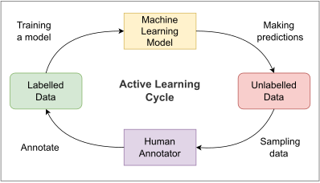

# Active Learning

The annotation process can sometimes be extensively time-consuming and expensive.
Images and videos can often be scraped or even taken automatically, however labeling for tasks like segmentation and motion detection is laborious.
Some domains, such as medical imaging, require domain knowledge from experts with limited accessibility.

When the unlabeled data is abundant, wouldn’t it be nice if you could pick out the 5% of samples most useful to your model, rather than labeling large swathes of redundant data points?
This is the idea behind active learning.

**Encord Active** provides you with the tools to take advantage of the active learning method, and it's integrated with **Encord Annotate** to deliver the best annotation experience.

If you are already familiar with the active learning foundation, continue your read with an exploration of **Encord Active**'s acquisition functions and common workflows.

import DocCardList from "@theme/DocCardList";

<DocCardList />

## What is active learning?

Active learning is an iterative process where a [machine learning model](https://encord.com/blog/introduction-to-building-your-first-machine-learning) is used to select the best examples to be labeled next.
After annotation, the model is retrained on the new, larger dataset, then selects more data to be labeled until reaching a stopping criterion.
This process is illustrated in the figure below.

Check out our [practical guide to active learning for computer vision](https://encord.com/blog/a-practical-guide-to-active-learning-for-computer-vision/) to learn more about active learning, its tradeoffs, alternatives and a comprehensive explanation on active learning pipelines.

