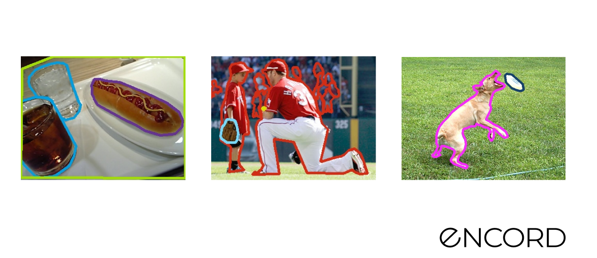
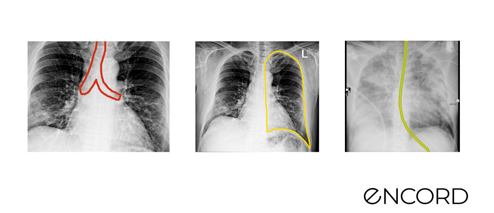
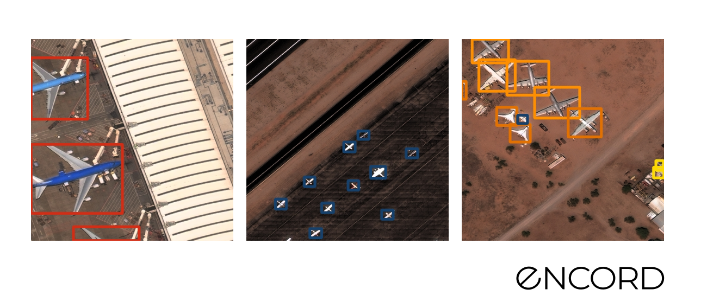
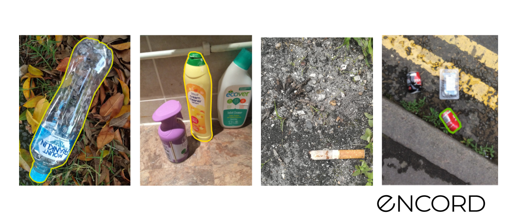

# Downloading Sandbox Dataset

To get started quickly with a sandbox dataset, you run the following command.

```shell
# within venv
encord-active download
```

The script will ask you to choose a project, navigate the options with <kbd>↑</kbd> and <kbd>↓</kbd> and hit <kbd>enter</kbd>.

When the download process is complete, you visualise the results by following the printed instructions.
For more details, see the [Open Encord Active](/cli/open-encord-active) page.


If you have a dataset you'd like us to include in the sandbox please submit an issue on Github or contact us directly. We'd love to help!

## Berkeley Deep Drive

 **About the dataset**

- **Research Paper:** BDD100K: A Diverse Driving Dataset for Heterogeneous Multitask Learning
- **Authors:** Fisher Yu, Haofeng Chen, Xin Wang, Wenqi Xian, Yingying Chen, Fangchen Liu, Vashisht Madhavan, Trevor Darrell
- **Dataset Size:** 1000 images & 12973 annotations
- **Categories:** 8 classes
- **License:** BSD 3-Clause License
- **Release:** 21st September, 2020
- **Read more:** [Webpage](https://bdd-data.berkeley.edu/) & [GitHub](https://github.com/bdd100k/bdd100ks)

Sample pictures:


## COCO Validation 2017 Dataset

 **About the dataset**

- **Research Paper:** [Microsoft COCO: Common Objects in Context](https://arxiv.org/abs/1405.0312)
- **Author:** [Tsung-Yi Lin](https://arxiv.org/search/cs?searchtype=author&query=Lin%2C+T) , [Michael Maire](https://arxiv.org/search/cs?searchtype=author&query=Maire%2C+M), [Serge Belongie](https://arxiv.org/search/cs?searchtype=author&query=Belongie%2C+S), [Lubomir Bourdev](https://arxiv.org/search/cs?searchtype=author&query=Bourdev%2C+L) , [Ross Girshick](https://arxiv.org/search/cs?searchtype=author&query=Girshick%2C+R), [James Hays](https://arxiv.org/search/cs?searchtype=author&query=Hays%2C+J), [Pietro Perona](https://arxiv.org/search/cs?searchtype=author&query=Perona%2C+P), [Deva Ramanan](https://arxiv.org/search/cs?searchtype=author&query=Ramanan%2C+D), [C. Lawrence Zitnic](https://arxiv.org/search/cs?searchtype=author&query=Zitnick%2C+C+L), [Piotr Dollár](https://arxiv.org/search/cs?searchtype=author&query=Doll%C3%A1r%2C+P)
- **Dataset Size:**  5000 images, 4784 annotations
- **Categories:** 81 classes
- **License:** CC BY 4.0
- **Release:** 1st, May, 2014
- **Read More:** [GitHub](https://github.com/cocodataset/cocodataset.github.io) & [Webpage](https://cocodataset.org/#home)


Sample pictures:


## Covid 19 Segmentation Dataset

**About the dataset**

- **Research Paper:** Unknown 
- **Author:** Unknown
- **Dataset Size:** 100 images & 602 annotations
- **Categories:**  13 classes
- **License:** CC BY 4.0
- **Release:** Unknown
- **Read more:** [GitHub](https://github.com/GeneralBlockchain/covid-19-chest-xray-segmentations-dataset)

Sample pictures:


## Rareplanes

 **About the dataset**

- **Research Paper:** [RarePlanes: Synthetic Data Takes Flight](https://arxiv.org/abs/2006.02963)
- **Author:** [Jacob Shermeyer](https://arxiv.org/search/cs?searchtype=author&query=Shermeyer%2C+J), [Thomas Hossler](https://arxiv.org/search/cs?searchtype=author&query=Hossler%2C+T), [Adam Van Etten](https://arxiv.org/search/cs?searchtype=author&query=Van+Etten%2C+A), [Daniel Hogan](https://arxiv.org/search/cs?searchtype=author&query=Hogan%2C+D), [Ryan Lewis](https://arxiv.org/search/cs?searchtype=author&query=Lewis%2C+R), [Daeil Kim](https://arxiv.org/search/cs?searchtype=author&query=Kim%2C+D)
- **Dataset Size:** 2710 images & 6812 annotations
- **Categories:**  7 plane categories
- **License:** CC 4.0 BY SA
- **Release: 4** June, 2020
- **Read More:** [Webpage](https://www.cosmiqworks.org/rareplanes/)

Sample pictures:


## TACO Dataset

**About the dataset**

- **Research Paper:** [TACO: Trash Annotations in Context for Litter Detection](https://arxiv.org/abs/2003.06975)
- **Author:** Pedro F Proença, Pedro Simões
- **Dataset Size:** Official: 1500 images, 4784 annotations & Unofficial: 3736 images, 8419 annotations
- **Categories:** 60 litter categories
- **License:** CC BY 4.0
- **Release:** 17th, March, 2020
- **Read More:** [GitHub](https://github.com/pedropro/TACO) & [Webpage](http://tacodataset.org/)

Sample pictures:



## Limuc Ulcerative Colitis Classification

- **Research Paper:** Improving the Computer-Aided Estimation of Ulcerative Colitis Severity According to Mayo Endoscopic Score by Using Regression-Based Deep Learning
- **Authors:** Gorkem Polat, MSc, Haluk Tarik Kani, MD, Ilkay Ergenc, MD, Yesim Ozen Alahdab, MD, Alptekin Temizel, PhD, Ozlen Atug, MD
- **Dataset Size:** 11276 images
- **Categories:** Medical (Endoscopy/Colonoscopy)
- **License:** Creative Commons Attribution 4.0 International
- **Release:** 14th March 2022
- **Read more:** [Webpage](https://www.notion.so/Jan-9-2023-c23ea70fe8b64b889dc8b8ad4f77ad18) & [GitHub](https://github.com/GorkemP/labeled-images-for-ulcerative-colitis)
