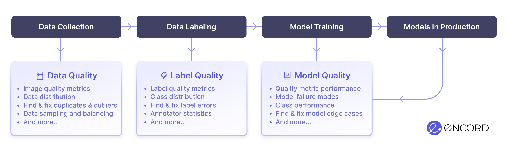

import Link from "@docusaurus/Link";

<table>
  <tr style={{ border: "none" }}>
    <td style={{ border: "none" }}>
      
      
      
      
    </td>
    <td style={{ border: "none" }}>
      
      
      
      
      
    </td>
  </tr>
</table>

[Encord Active][encord-active-landing] is an open-source active learning toolkit that helps you find failure modes in your models and improve your data quality and model performance.

Use Encord Active to visualize your data, evaluate your models, surface model failure modes, find labeling mistakes, prioritize high-value data for re-labeling and more!

## When to use Encord Active?

Encord Active helps you understand and improve your data, labels, and models at all stages of your computer vision journey.

Whether you've just started collecting data, labeled your first batch of samples, or have multiple models in production, Encord Active can help you.

## What Data does Encord Active Support?

| Data Types                                   |     | Labels          |     | Project sizes                                 |               |
| -------------------------------------------- | --- | --------------- | --- | --------------------------------------------- | ------------- |
| `jpg`                                        | ✅  | Bounding Boxes  | ✅  | Images                                        | 50.000        |
| `png`                                        | ✅  | Polygons        | ✅  | Videos \* | 50.000 frames |
| `tiff`                                       | ✅  | Segmentation    | ✅  |                                               |               |
| `mp4` \* | ✅  | Classifications | ✅  |                                               |               |
|                                              |     | Polylines       | 🟡  |                                               |               |

* Requires an Encord Annotate account

[encord-active-landing]: https://encord.com/encord-active/
