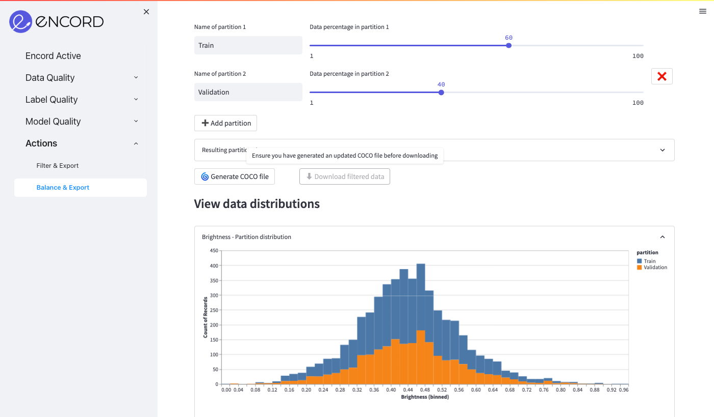

# Balance & Export

## Export to COCO file

The Balance & Export feature allows you to create and export balanced data partitions over a series of metrics. 
There are three main sections in the Balance & Export page:
- **Metrics**: Select the metrics to balance the data over. You can also select the random seed for the data partitioning.
- **Partitions**: Create data partitions and specify their percentage size.
- **Distribution visualiser**: Displays the distribution of each partition for each metric.

After you have selected a set of metrics and created data partitions, click on **Generate COCO file** and sit tight, this can take up to a few minutes depending on the number of samples. 

Once the COCO file is generated, the **Download filtered data** button will unlock. Click it to download the resulting file.

