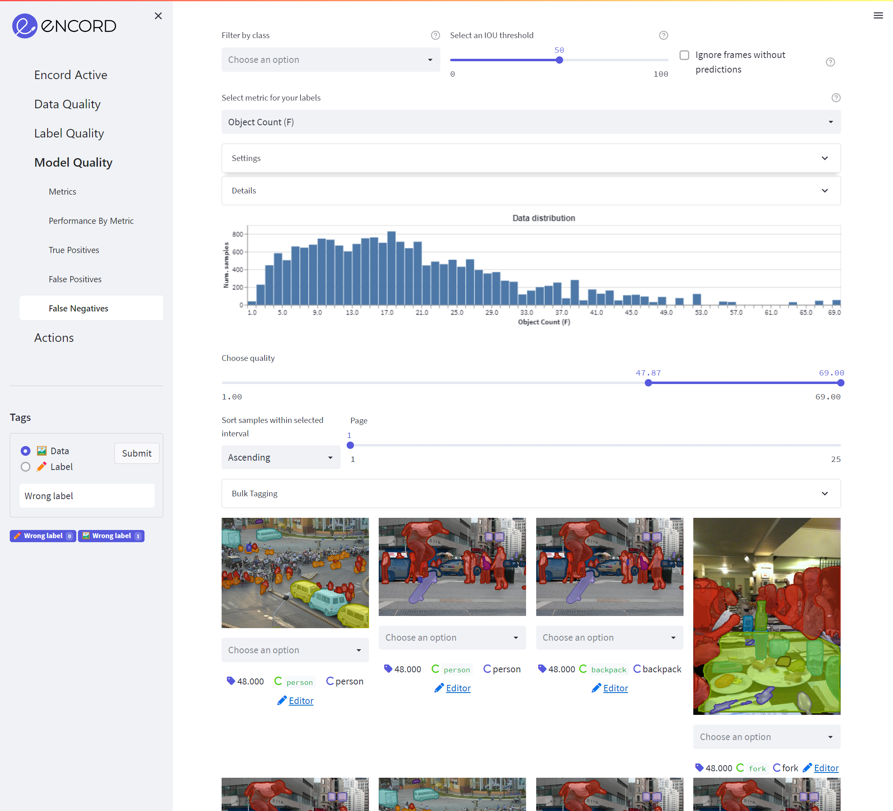

# False Negatives

These are the labels that were not matched with any predictions.

The purple boxes mark the false negatives. That is the labels that were not matched to any predictions. The remaining 
objects are predictions, where colors correspond to their predicted class (identical colors to labels objects in the editor).

