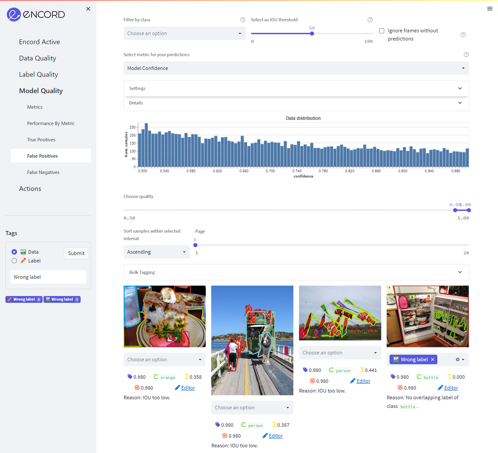

# False Positives

These are the predictions for which either of the following is true:

1. The IOU between the prediction and the best matching label was too low
2. There was another prediction with higher model confidence which matched the label already
3. The predicted class didn't match

The red boxes mark the false positive predictions. The remaining colors correspond to the dataset labels with the 
colors you are used to from the label editor.

