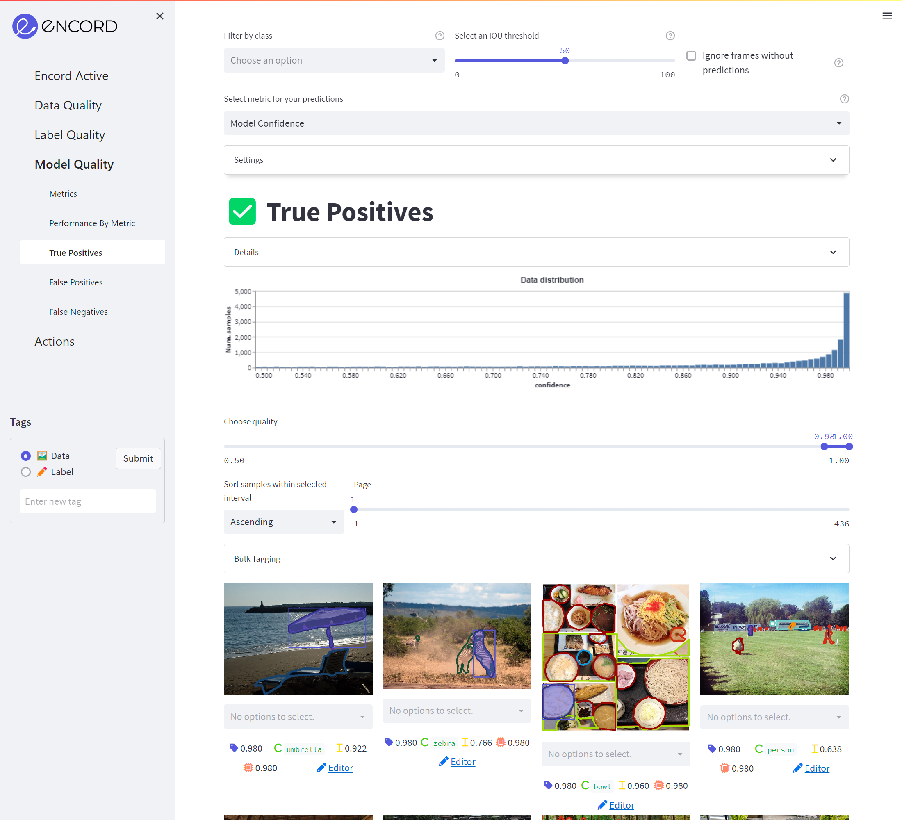

# True Positives

These are the predictions for which the IOU was sufficiently high and the confidence score was the highest amongst 
predictions that overlap with the label.

The purple boxes mark the true positive predictions.
The remaining colors correspond to the dataset labels with the colors you are used to from the label editor.

