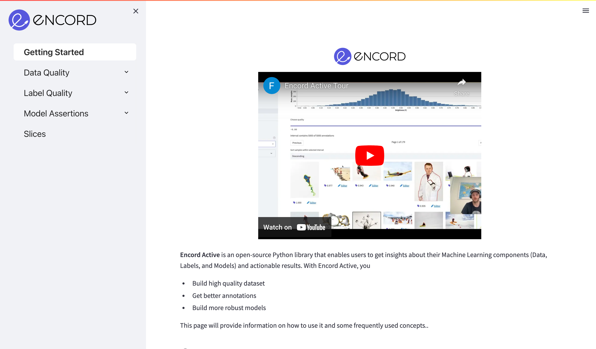
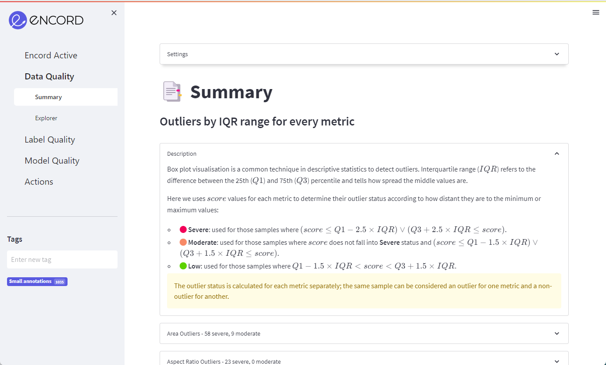
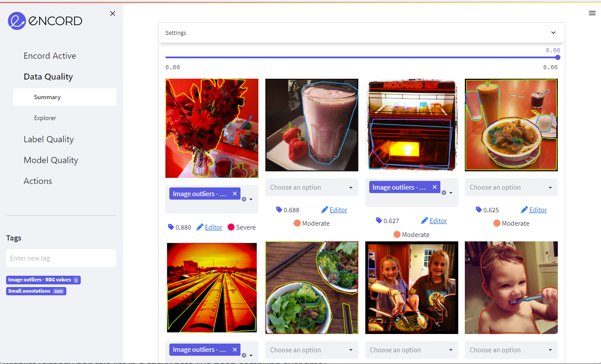
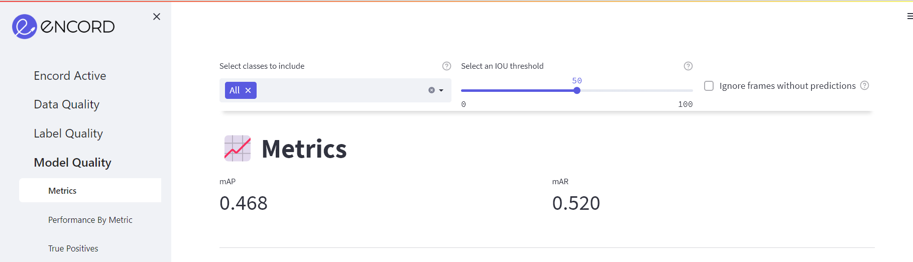
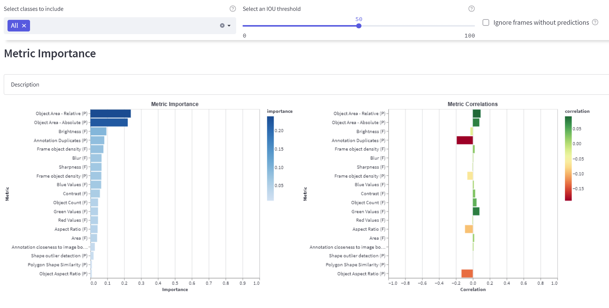
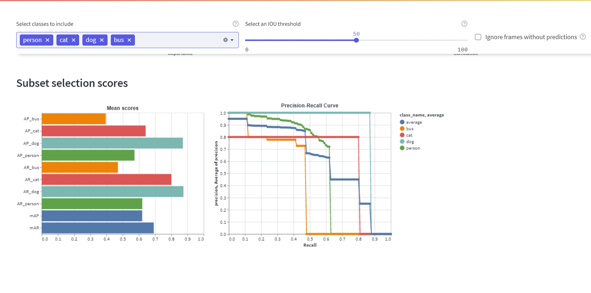
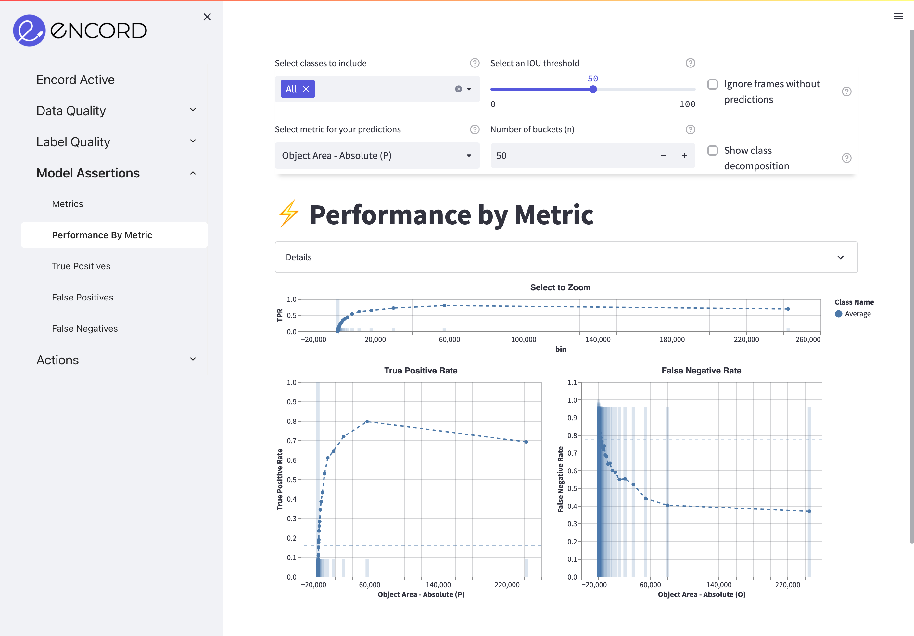

import Link from "@docusaurus/Link";
import TOCInline from "@theme/TOCInline";
import getSubsectionNodes from "@site/src/js/toc-filter-functions";

# Touring the Quickstart Dataset

In this tutorial, we will dive into the quickstart dataset and show you some cool features of Encord Active.
You will go through the following steps:

<TOCInline toc={toc.filter((node) => node.level === 2)} />

:::note

This tutorial assumes that you have [installed](../installation) `encord-active`.

:::

## 1. Opening the quickstart dataset

To open the quickstart dataset run:

```shell
$ encord-active quickstart
```

Now `encord-active` will download the dataset and open the UI in your browser.



:::caution

If the command hangs and nothing happens in your browser, go to <Link to={"http://localhost:8501"}>http://localhost:8501</Link>.

:::

### About the dataset

The Quickstart dataset contains images and labels for 200 random samples from the [COCO 2017 validation set](https://cocodataset.org/#download) with a pre-trained [MASK R-CNN RESNET50 FPN V2](https://arxiv.org/abs/1703.06870) model.

First thing we try is to find, tag, and export image outliers.

## 2. Finding and tagging outliers {#find-and-tag-outliers}

### Identifying metrics with outliers

When you open Encord Active, you will start on the landing page.

Expand the "Data Quality" tab in the left sidebar and click the "Summary" page:



On the summary page, you can see all the outliers that Encord Active automatically found based on all the [Quality Metrics](/category/quality-metrics) that were computed for the images. The individual dropdown menus will show you how this metric was computed, how many outliers were found and some of the most severe outliers.

Scroll down on the main view and click the "Red Values Outliers" section and expand it:


:::tip

You can find other sources of outliers errors by inspecting the other tabs. Good places to start could be the "Brightness" and "Blur" sections in the App.

:::

### Tagging outliers

To tag an image identified as an outlier, you first need to add a new tag by typing in the tag name in the left sidebar and hitting enter.

Afterwards, you can add the tag to the images you see in the outlier pane by selecting the tag from the drop-down below each image:



Once you are satisfied with your tagged subset of images move on to exporting.

## 3. Exporting samples for re-labeling or other actions

Suppose you have now tagged all the images that you would like to export for re-labeling or other actions.
Then, you go to the _Actions_ -> _Filter & Export_ tab in the left sidebar and filter by the tag that you created.


_Note how your data has been filtered to only the rows that you tagged._

Now you can _Generate COCO file_, _Clone_ the data into a new Encord project, or send the data for _Review_, _Re-label_, or _Augmentation_ tasks.

## 4. Figuring out what metrics influence model performance {#figuring-out-what-metrics-influence-model-performance}

Encord Active also allows you to figure out which metrics influence your model performance the most.
In this section, we'll go through a subset of those:

<TOCInline
  toc={getSubsectionNodes(
    toc,
    "figuring-out-what-metrics-influence-model-performance"
  )}
/>

### The high level view of model performance

#### mAP and mAR scores

First, navigate to the _Model Quality_ > _Metrics_ page where you find multiple insights into your model performance.

The first section will give you the _mean Average Precision (mAP)_ and the _mean Average Recall (mAR)_ of your model based on the IOU threshold set in the top of the page.



If you drag the slider, you will notice how the score changes.
You can also choose to see the aggregate score for certain classes by selecting them in the drop-down to the left.

#### Metric importance and correlation

In the next section (the _Metric Importance_), you will find importances and correlations of your model performance as function of metrics.



From this overview, you can see that, e.g., "Object Area - Relative (P)" has a high importance for the model performance.

:::note

The "(P)" and the "(F)" in the labels of the plots indicate whether the metric was run on predictions or frames, respectively.

:::

Next, we can jump to the _Performance by Metric_ page and take a closer look at exactly how the model performance is affected by this metric.
However, we want to show you the rest of this page prior to doing this.
You can skip straight ahead to the [Inspecting Model Performance for a Specific Metric](#inspecting-model-performance-for-a-specific-metric) if you are too curious to wait.

#### Subset scores

Before jumping into specific metrics, we want to show you the decomposition of the model performance based on individual classes.
If you look in the _Subset selection scores_ section, you will find the average precision (AP) and average recall (AR) scores for each individual class.



:::note

We've choosen a subset of classes [`person`, `cat`, `dog`, `bus`] in the settings in the top of the page to make the plots more digestible.

:::

- From the left plot (Mean scores), we can see the AP and the AR for each individual class.
- The right plot shows the precision-recall curves for each of the classes.
- From these plots, we learn that the model performs better on the `dog` class than it does on, e.g., the `bus` class.
- To learn for which instances the model works and for which it doesn't, you can look in the _True Positives_, _False Positives_, and _False Negatives_ tabs to see concrete instances of the three success/failure modes.

### Inspecting model performance for a specific metric

Above, we noticed that the "Object Area - Relative (P)" metric has a high importance on the model performance.
To learn more about how the specific metric affects the model performance you:

1. Click the _Performance By Metric_ tab in the sidebar.
2. Select the "Object Area - Relative (P)" metric in the settings in the top.



The plot shows the precision and the false negative rate as a function of the selected metric; the "Object Area - Relative (P)" in this case.
We can see how when the model predictions are small in terms of the absolute area, then the true-positive rate is low (bad), while larger predictions are more often correct (good).
Similarly, when labels are small, the false negative rate is high (bad), while larger labels are less likely to be issued by the model (good).

The performance graphs can be showed by each metric and are easy to interact with using the cursor and scroll function:


## 5. Summary

This concludes the tour of the quickstart dataset. In this tutorial we covered opening the quickstart dataset, finding image outliers, and analysing the performance of an off-the-shelf object detection model on the dataset.
By now, you should have a good idea about how Encord Active can be used to understand your data, labels, and model.

### Next steps

- We have only covered a few of the page in the app briefly in this tutorial. 
- To learn more about concrete actionable steps you can take to improve your model performance, we suggest that you have a look at the [Workflow section](/category/workflows).
- If you want to learn more about the existing metrics or want to build your own metric function, the [Metrics section](/category/quality-metrics) is where you should continue reading.
- Finally, we have also included some in-depth descriptions the [Command Line Interface](/cli).
