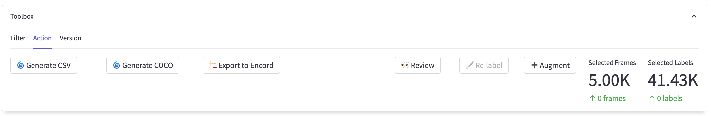
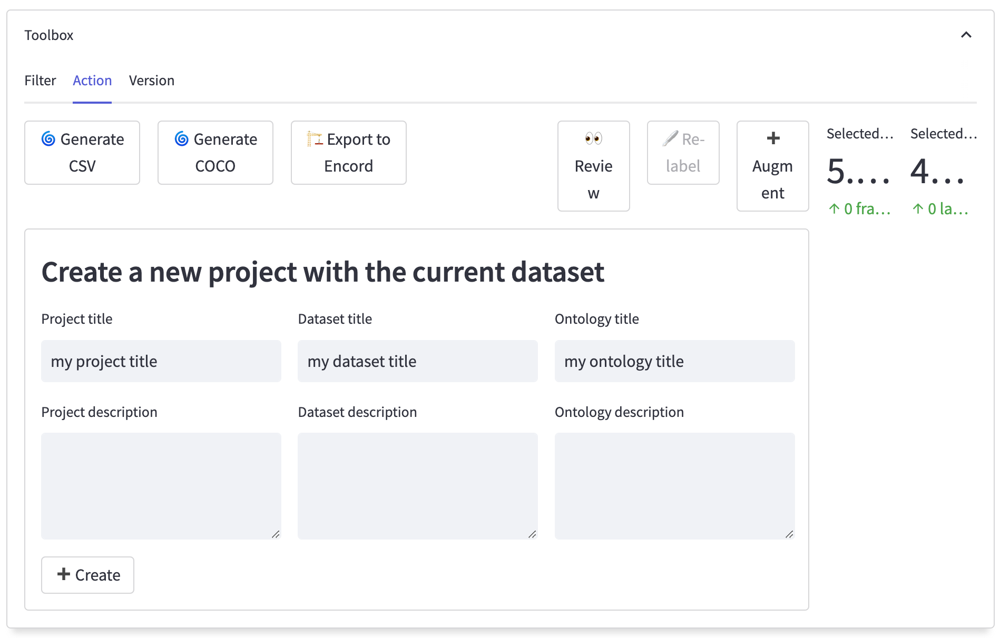

import TOCInline from "@theme/TOCInline";
import Tabs from "@theme/Tabs";
import TabItem from "@theme/TabItem";

# Exporting

**Learn how to export your data from Encord Active**

The export feature in Encord Active provides the flexibility to export data based on specific metric values or the tags created during the data exploration process.
This feature offers flexibility and customization to meet your specific needs and criteria.

By leveraging these options, you can selectively export data points that meet certain metric thresholds or belong to specific tag categories.
This targeted export functionality enables you to focus on the data that is most relevant to your analysis or sharing requirements.

Encord Active provides the following export options:
<TOCInline toc={toc.filter((node) => node.level === 2)} />

## Generate CSV file

This option allows you to export your data in CSV (Comma-Separated Values) format.
It provides a tabular representation of your data, making it easily accessible for further analysis or integration with other tools and platforms.

**Steps to export your data to a CSV file:**
1. Navigate to the explorer pages and use the [standard filter feature][standard-filter-feature] in the toolbox to select the specific data you want to export.
2. In the same toolbox, locate and access the _Action_ tab.
   
3. Within the _Action_ tab, you will find the <kbd>Generate CSV</kbd> button.
   Click on this button to initiate the generation of the CSV file.
   Please note that the processing time may vary depending on the number of samples you have selected.
4. Once the CSV file generation process is complete, the <kbd>⬇ Download CSV</kbd> button will unlock.
   Click it to download the resulting file.

:::caution
Please note that the structure of the CSV file exported from Encord Active may undergo changes as the platform continues to evolve and mature.
As new features and enhancements are introduced, there might be updates to the structure or format of the exported CSV file.

It is advisable to stay informed about any updates or announcements regarding changes to the CSV file structure.
Keeping track of documentation, release notes, or any communication from the Encord Active team will help you stay up to date with any modifications that may affect the structure of the exported CSV file.
:::

## Generate COCO file {#coco}

This option enables you to export your data in COCO format, a widely used standard for storing annotations and object detection data.
This format ensures compatibility with various computer vision and machine learning frameworks and tools.

**Steps to export your data to a COCO file:**
1. Navigate to the explorer pages and use the [standard filter feature][standard-filter-feature] in the toolbox to select the specific data you want to export.
2. In the same toolbox, locate and access the _Action_ tab.
   
3. Within the _Action_ tab, you will find the <kbd>Generate COCO</kbd> button.
   Click on this button to initiate the generation of the COCO file.
   Please note that the processing time may vary depending on the number of samples you have selected.
4. Once the COCO file generation process is complete, the <kbd>⬇ Download filtered data</kbd> button will unlock.
   Click it to download the resulting file.

## Export to the Encord platform {#export-to-encord}

Encord Active also provides the option to export your local project directly to the Encord platform.
This allows you to seamlessly transfer your data to Encord, where you can leverage additional features and capabilities for annotation, collaboration, and project management.

**Steps to export your local project to the Encord platform:**
1. Navigate to the explorer pages and use the [standard filter feature][standard-filter-feature] in the toolbox to select the specific data you want to export.
2. In the same toolbox, locate and access the _Action_ tab.
   
3. Within the Action tab, you will find the <kbd>🏗 Export to Encord</kbd> button.
   Click on it to initiate the export process.
4. In the export dialog, you will be prompted to choose an ontology, dataset, and project title for the exported data.
   Select the appropriate options based on your preferences and requirements.
   
5. Once you have chosen the ontology, dataset, and project title, press the <kbd>➕ Create</kbd> button to initiate the export.
   The export process may take some time depending on the size and complexity of your project.
   
After following the steps mentioned above, the data from your local project will be exported to the Encord platform.
You will be able to track the progress at the bottom of the export dialog.
This progress indicator will provide you with real-time updates on the status of the export process, ensuring transparency and visibility into the export operation.

Once the export is complete, you can access the exported data in the Encord platform, where you can further annotate, analyze, and collaborate on your project.
Encord platform has you covered with a comprehensive annotation environment with advanced tools for efficient annotation, data exploration, model management, and collaboration among others.

:::info
When using the standard filter feature, every selected image and video will be cloned along with all their associated labels.
:::

[standard-filter-feature]: ../user-guide/filtering#standard-filter-feature
