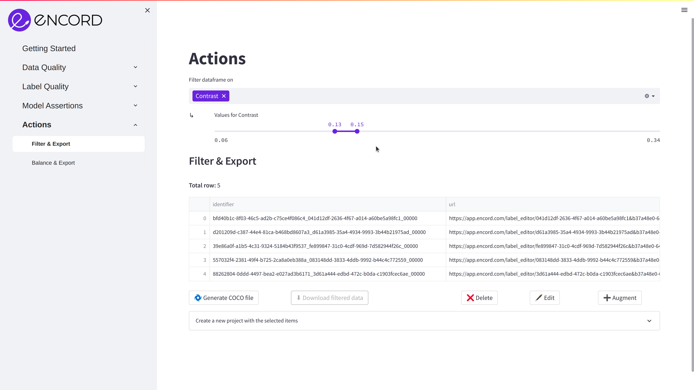
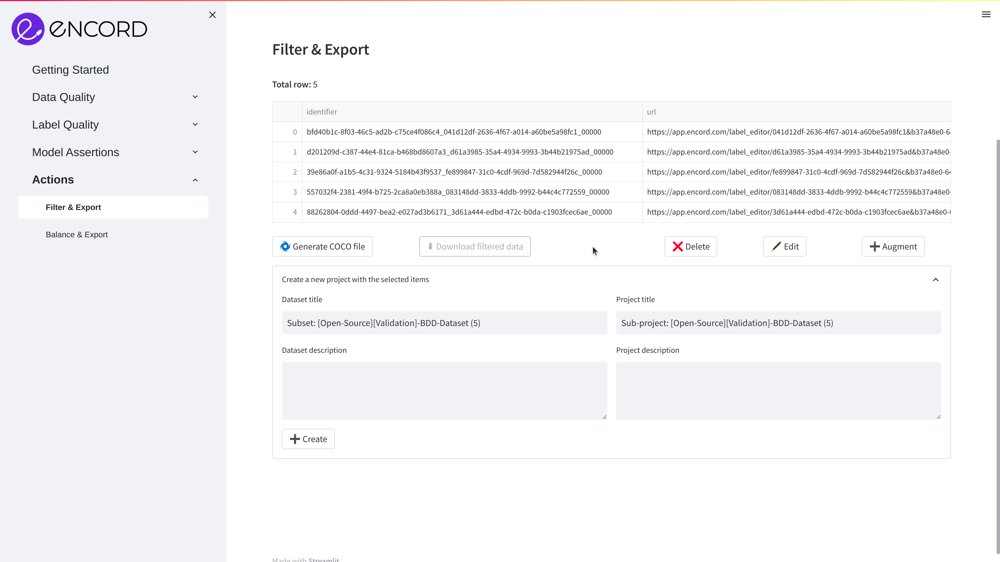

# Exporting

**Learn how to export your data from Encord Active**

## Export to COCO file

The Filter & Export feature allows you to export data according to specific metric values or the tags created during the data exploration process.

After you have created a filtering rule, click on **Generate COCO file** and sit tight, this can take up to a few minutes depending on the number of samples.

Once the COCO file is generated, the **Download filtered data** button will unlock. Click it to download the resulting file.

## Export to Encord

Additionally, you can also clone the data and labels directly to the Encord labelling platform.

1. Click the _🏗 Export to Encord_ button
2. Choose an ontology, dataset and project title
3. Pres the _➕ Create_ button

The data will be exported to Encord. You can follow the progress in the bottom of the page.

:::info

Every image and video selected will be cloned with all labels associated to them.

:::
