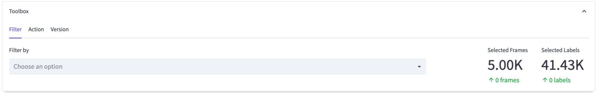
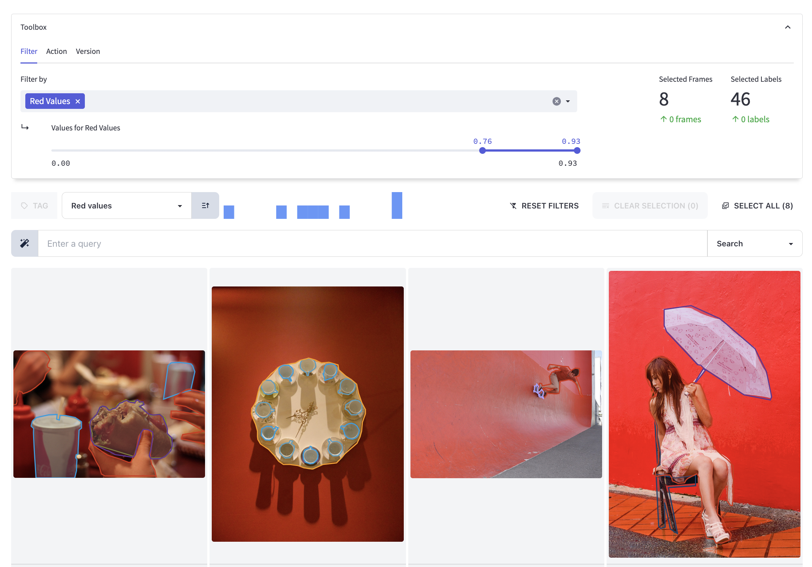
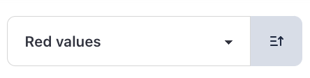
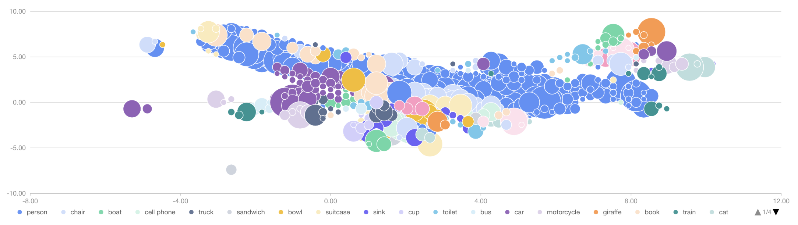
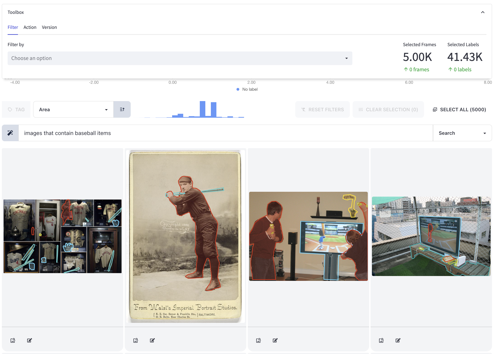

import TOCInline from "@theme/TOCInline";
import Tabs from "@theme/Tabs";
import TabItem from "@theme/TabItem";

# Filtering

**Learn how to filter your data in Encord Active**

Filtering data in Encord Active is crucial for various reasons.
It enables insights and actionable results on the following key aspects and more:
1. Identification of patterns, trends, or anomalies within a subset of the data.
2. Recognition of duplicates, outliers and inconsistencies.
3. Removal of irrelevant, noisy or erroneous data.
4. Understand model's behaviour and potential skewness when facing different subsets of the data. 
5. **[Encord project only]** Update tasks status to prioritize some unannotated images in the labeling stage and send labels to be reviewed/fixed, all along with descriptive comments for the project users (e.g. annotators and reviewers).

You have several options to filter your data in Encord Active:
<TOCInline toc={toc.filter((node) => node.level === 2)} />

## Standard filter feature {#standard-filter-feature}

The standard filter feature provides several options to refine your search:
1. Data points metadata filters: You can filter data based on metadata attributes like `Object Class` and `Annotator`.
   This allows you to focus on specific classes or annotations created by specific annotators.
2. User-defined tag filters: You can apply filters based on user-defined tags.
   This enables you to categorize and filter data according to custom tags that you have assigned.
3. Metric filters: You can utilize metrics, including built-in metrics like `Image Diversity` and `Annotation Duplicates`, as well user-defined metrics, to filter data.
   This helps in selecting data points based on potentially complex properties. 

**Steps to use the standard filter feature over the project data and labels**
1. Go to the toolbox in the explorer pages and locate the filter feature.
  
2. Choose one or more filters from the available options.
3. For numerical filters, specify the threshold range. For categorical filters, select the groups of interest.
  

:::tip
Using one of the UI components, you have the ability to customize the visualization order of the filtered data based on a specific metric.
You can choose whether to display the data in ascending or descending order, according to your preferences.

:::

## Embedding plot

[//]: # (todo move the embedding explanation when we have a dedicated section for the UI elements)
The embedding plot in Encord Active is a two-dimensional visualization technique used to represent high-dimensional data in a more interpretable and visually accessible form.
By reducing the dimensionality of the data, the embedding plot helps preserve the underlying structure and patterns of the original data.

In the embedding plot, each data point is represented as a single point in the two-dimensional space.
The proximity of points in the plot reflects the similarity or shared characteristics of the corresponding high-dimensional data points.
Points that are closer together indicate higher similarity, while points that are farther apart suggest greater dissimilarity.

[//]: # (end of move the embedding explanation when we have a dedicated section for the UI elements)

In the embedding plot of Encord Active, you have the ability to select points within a specific rectangular area.
This feature allows you to focus on a particular subset of data points and analyze their characteristics or patterns.

By defining a rectangular area on the plot, you can quickly isolate and examine the data points that fall within that region.
This selection can be based on specific criteria or visual observations.
Once the points are selected, you can further explore their attributes or perform additional analysis on the chosen subset.

This functionality enhances your ability to interact with the data, enabling you to zoom in on specific regions of interest and gain deeper insights into the underlying patterns and relationships within the selected area.
It provides a flexible and intuitive way to analyze and understand the data points within the dataset in a more targeted manner.

:::tip
In addition to selecting points within a rectangular area, the embedding plot in the _Label Quality_ explorer offers the functionality to filter data points based on the label classes.
:::

## Natural language search

The natural language search textbox feature enables users to enter descriptive queries in everyday language, such as "images that contain baseball items".
The system intelligently processes the query and retrieves images that match the description.
This feature simplifies and greatly enhances the search experience within Encord Active, allowing users to find relevant images without the need for specific keywords or complex search parameters.

:::note
The natural language search textbox is exclusively available in the hosted version of Encord Active.
:::
