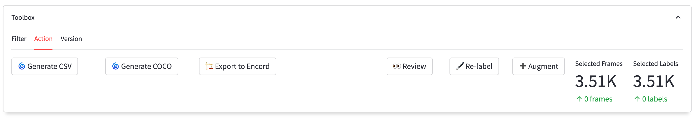

# Re-labeling

**Learn how to submit your data for labeling in Encord Annotate**

When examining your project data, you might come across labels that appear incorrect or are missing altogether.
With Encord Active, you have the ability to highlight such data and seamlessly transfer it to Encord Annotate, at the dedicated labeling stage for your project.
This empowers annotators to address any missing elements and enhance the overall quality of your labels, ensuring a more accurate and comprehensive data annotation process.

## Steps to send data to the labeling stage

0. **[Optional]** Use the [filter feature](../user-guide/filtering) from the toolbox in the _Data Quality_ or _Label Quality_ _Explorer_ section to choose the desired data. 
1. Access the Action tab from the toolbox in the _Data Quality_ or _Label Quality_ _Explorer_ section.
2. Click the _🖋 Re-label_ button.
3. Verify the number of tasks ready for submission to the labeling stage is correct and press the _Confirm_ button.  
4. **[Optional]** Navigate to the project in Encord Annotate and explore the task modifications in the _Summary_ tab.

:::note
The **re-label feature** is currently limited to workflow projects.

To upgrade your project to a workflow project, please reach out to us via [Discord][join-discord] or [email][ea-email].
Our team will be happy to assist you with the necessary steps and provide further guidance.
:::

[join-discord]: https://discord.gg/TU6yT7Uvx3
[ea-email]: mailto:active@encord.com
