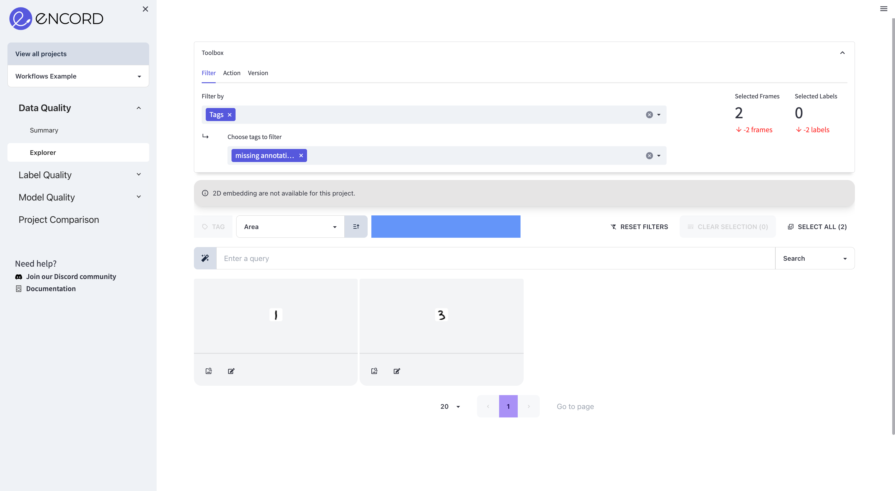
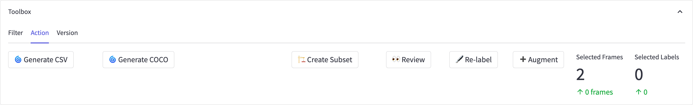
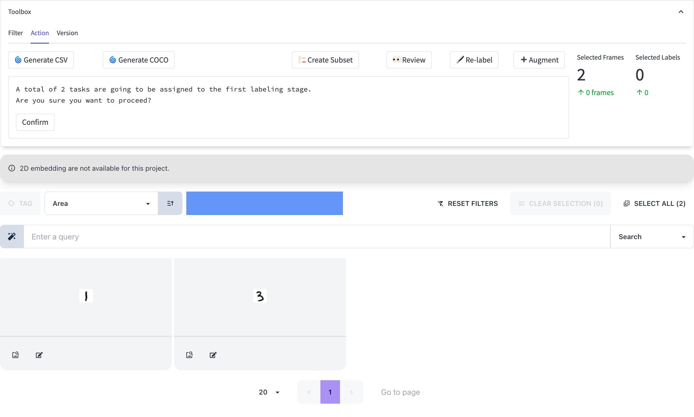
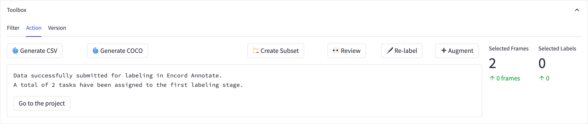

# Relabeling

**Learn how to submit your data for labeling in Encord Annotate**

When examining your project data, you might come across labels that appear incorrect or are missing altogether.
With Encord Active, you have the ability to highlight such data and seamlessly transfer it to Encord Annotate, at the dedicated labeling stage for your project.
This empowers annotators to address any missing elements and enhance the overall quality of your labels, ensuring a more accurate and comprehensive data annotation process.

## Steps to send data to the labeling stage

1. Go to the toolbox in the explorer pages and use the [filter feature](../user-guide/filtering) to choose the desired data.
   
2. Locate and access the _Action_ tab in the same toolbox.
   
3. Click the <kbd>🖋 Re-label</kbd> button.
   
4. Verify that the number of tasks ready for submission to the labeling stage is correct and press the <kbd>Confirm</kbd> button.  
   
5. **[Optional]** Navigate to the project in Encord Annotate and explore the task modifications in the _Summary_ tab.

  

    
    
Before sending the tasks to labeling

  

  

    
    
After sending the tasks to labeling

  

:::note
The **relabel feature** is currently limited to workflow projects.

To upgrade your project to a workflow project, please reach out to us via [Discord][join-discord] or [email][ea-email].
Our team will be happy to assist you with the necessary steps and provide further guidance.
:::

[join-discord]: https://discord.gg/TU6yT7Uvx3
[ea-email]: mailto:active@encord.com
