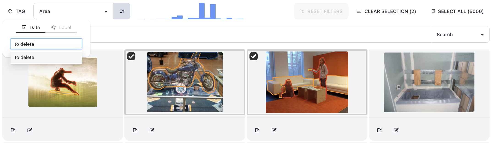
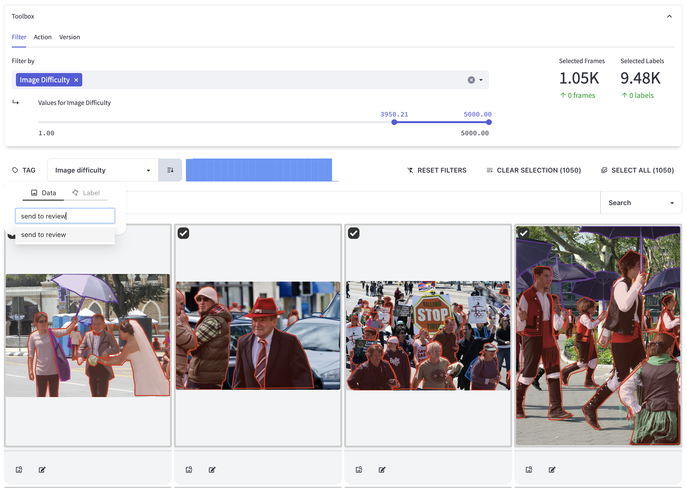

# Tagging

**Learn how to create tags in Encord Active**

Tagging is a versatile feature used in almost all Encord Active workflows, whether you're relabeling, augmenting, exporting, or deleting data.
You can tag images [individually](#individual-tagging) or in [bulk](#bulk-tagging).

In Encord Active, tagging data provides several advantages:
1. Organization: Tagging allows you to organize your data effectively within the platform.
  By assigning tags to your data points, you can group and categorize them based on common characteristics, making it easier to manage and navigate large subsets of the dataset.
2. Enhanced search and filtering: Tags in Encord Active enable powerful search and filtering capabilities.
  You can search for specific data points or filter data based on tags, narrowing down your focus to the relevant information you need.
3. Customizable metadata: Tags serve as customizable metadata that can provide additional context and information about your data.
  You can define and assign tags that align with your specific project requirements, providing meaningful insights and annotations for efficient data analysis.
4. Collaboration and knowledge sharing: Tagging promotes collaboration and knowledge sharing among team members in Encord Active.
  With consistent tagging conventions, team members can easily understand and access tagged data, facilitating efficient collaboration and ensuring everyone is on the same page.

These are just a few of the advantages of tagging in Encord Active, and there may be more benefits specific to your project and workflow.

## Individual tagging {#individual-tagging}

**Steps to tag individual images or labels:**
1. Access the explorer pages within Encord Active where your images or labels are located.
2. Locate and identify the specific images or labels you want to tag.
3. Select them by clicking on the checkbox in the top-left corner of each item. This will mark them for tagging.
4. Look for the <kbd>TAG</kbd> button, positioned above the natural language search bar, and click on it to initiate the tagging process.
5. Within the tagging interface, select the type of tag you want to apply. For images, choose the `data` type. For labels, select the `label` type.
6. Provide a name for the tag you want to apply to the selected images or labels. This name should reflect the relevant characteristic or information you want to associate with them.
7. Confirm your tag selection and apply it to the selected items by pressing <kbd>Enter</kbd>.
8. **[Optional]** Validate the successful application of the tag by visually confirming its presence on the tagged items or using the filtering options to isolate the tagged items based on the newly created tag.

## Bulk tagging {#bulk-tagging}

**Steps to tag images or labels in bulk:**
1. Access the explorer pages within Encord Active where your images or labels are located.
2. Utilize the [standard filter feature](../user-guide/filtering#standard-filter-feature) or the embedding plot to choose the desired data.
3. Locate the <kbd>Select All</kbd> button, positioned above the natural language search bar, and click on it to select the images or labels.
4. Look for the <kbd>TAG</kbd> button, above the natural language search bar, and click on it to initiate the tagging process.
5. Within the tagging interface, select the type of tag you want to apply. For images, choose the `data` type. For labels, select the `label` type.
6. Provide a name for the tag you want to apply to the selected images or labels. This name should reflect the relevant characteristic or information you want to associate with them.
7. Confirm your tag selection and apply it to the selected items by pressing <kbd>Enter</kbd>.
8. **[Optional]** Validate the successful application of the tag by visually confirming its presence on the tagged items or using the filtering options to isolate the tagged items based on the newly created tag.

