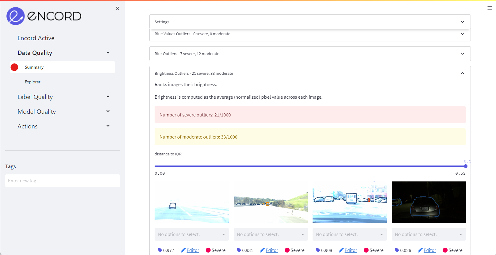
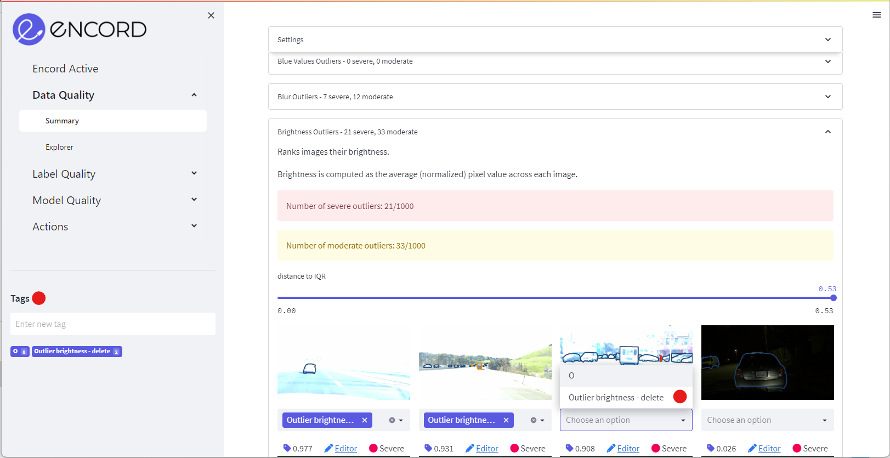
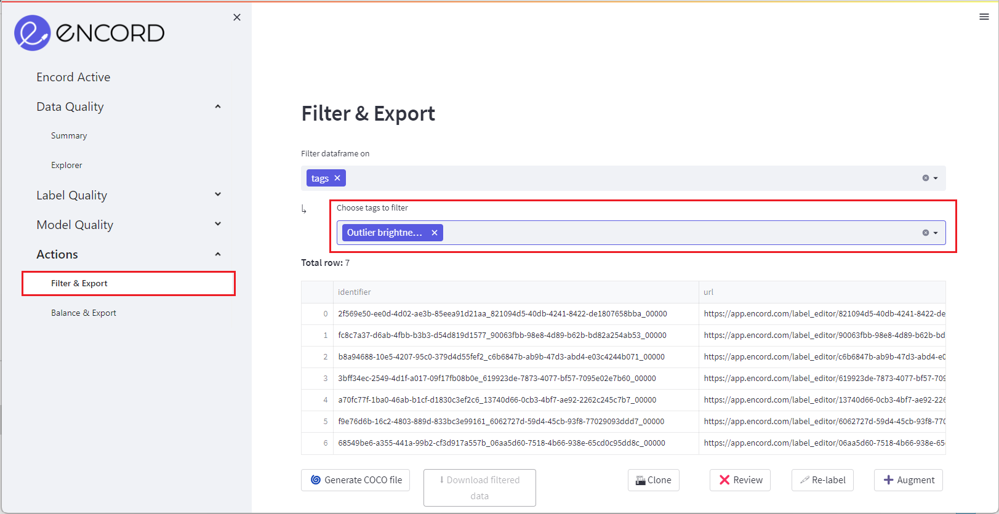

# Find Outliers

**Find outliers in your dataset using Encord Active's Data Quality tab**

With Encord Active, you can quickly find image outliers for pre-defined metrics, custom metrics, and label classes. 
Encord Active finds outliers using precomputed [Interquartile ranges](/pages/data-quality/summary).

 `Prerequisites:` Dataset  

### Setup
If you haven't installed Encord Active, visit [installation](/installation). In this workflow we will be using the BDD validation dataset.

## Steps

### 1. Find outliers
Navigate to the _Data Quality_ > _Summary_ tab. Here, the [metrics](/category/metrics) will be presented as expandable panes. 

Click on a metric to get deeper insight into _moderate outliers_ and _severe outliers_. The most severe outliers are presented first in the pane.

Use the slider to navigate your data from most severe outlier to least severe.

### 2. Tag outliers
When you have identified outliers of interest, use the [tagging](/workflows/tags) or [bulk tagging](/workflows/tags) feature to save a group of images.

After creating a tagged image group, you can access it at the bottom of the left sidebar in the _Actions_ tab.

### 3. Act on outliers
Within the _Actions_ tab, click _Filter dataframe on_ and select _tags_. Next, choose the tags you would like to export, relabel, augment, review, or delete from your dataset.

