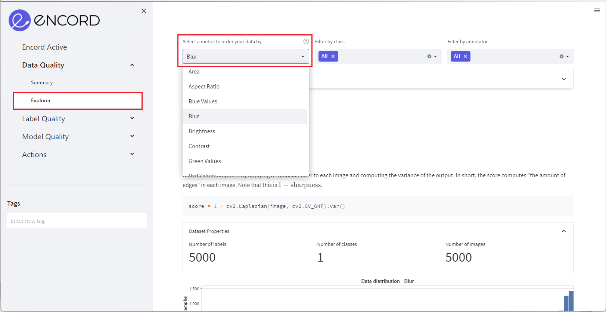
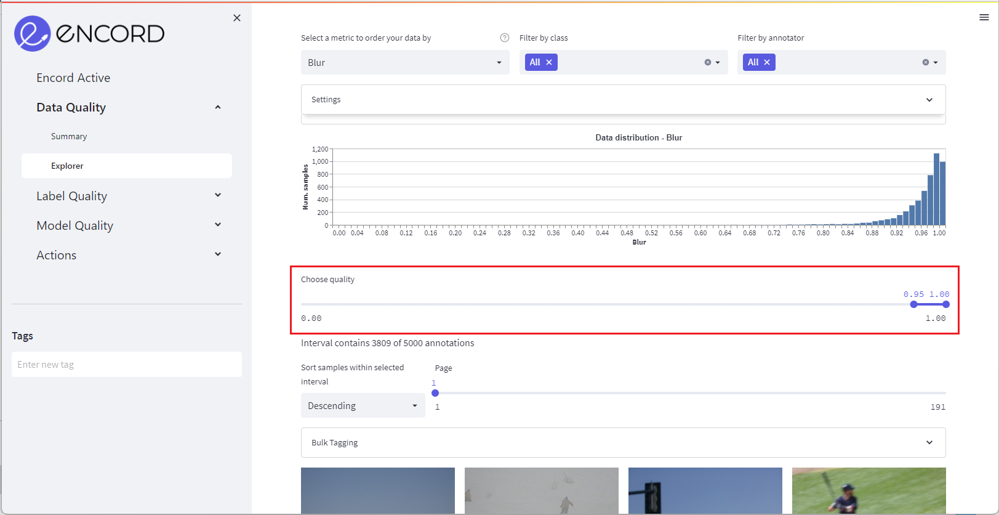
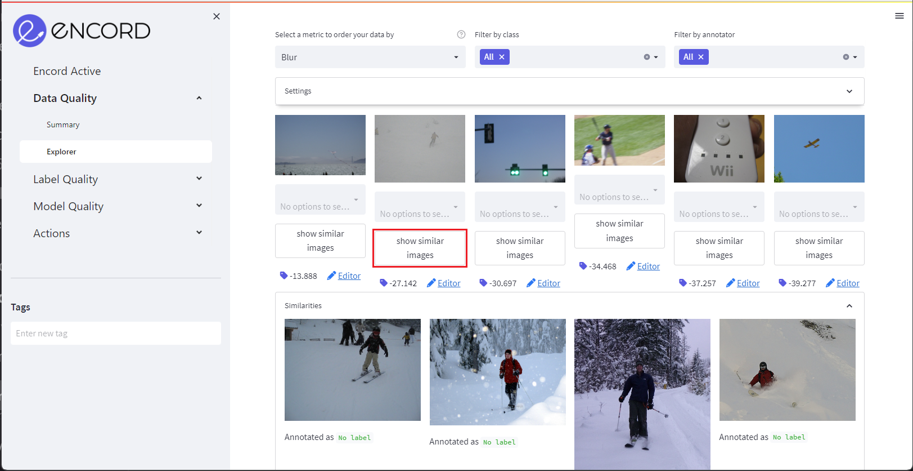

# Find Similar Images

**Mine edge cases, duplicates, and check the quality of your labels with visual similarity search**

Often, when you find characteristics of interest in your dataset you may want to identify other similar images (e.g., to send for relabelling or deletion).
Identifying these cases can help you understand where your data is, e.g., underrepresented or mislabelled. 
As your dataset grows, finding such cases manually becomes increasingly difficult. Using Encord Active's **similarity search** you can easily find semantically similar images in your dataset. 
When have identified an edge case or a duplicate, you can tag it and export or delete it in the _Actions tab_.

 `Prerequisites:` Dataset & Embeddings 


### Setup
If you haven't installed Encord Active, run:

```shell
python3.9 -m venv ea-venv
source ea-venv/bin/activate
# within venv
pip install encord-active
```

In this workflow, we will be using the COCO validation dataset:

```shell
# run download command
encord-active download
Loading prebuilt projects ...
[?] Choose a project: [open-source][validation]-coco-2017-dataset (1145.2 mb)
  >[open-source][validation]-coco-2017-dataset (1145.2 mb)
   [open-source][test]-limuc-ulcerative-colitis-classification (316.0 mb)
   [open-source]-covid-19-segmentations (55.6 mb)
   [open-source][validation]-bdd-dataset (229.8 mb)
```

After downloading the dataset, we visualise it:
```shell
# open the UI
cd path/to/[open-source][validation]-coco-2017-dataset
encord-active visualise
```

## Steps

### 1. Navigate to explorer tab
Navigate to the _Data Quality_ > _Explorer_ tab and select a quality metric in the top left menu to order your data by.



### 2. Select quality metric
Select a quality metric to index your images by:



### 3. Find similar images
Select an image of interest and click _Show Similar Images_. Encord Active shows the most semantically similar images below the image in a new tab.



