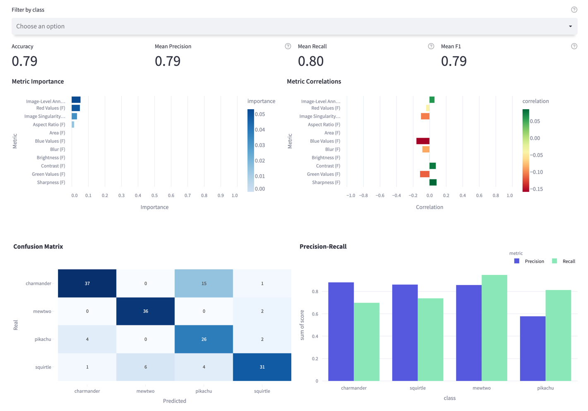
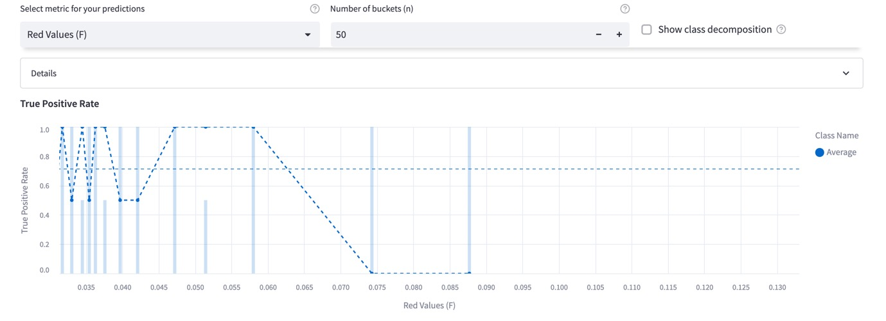
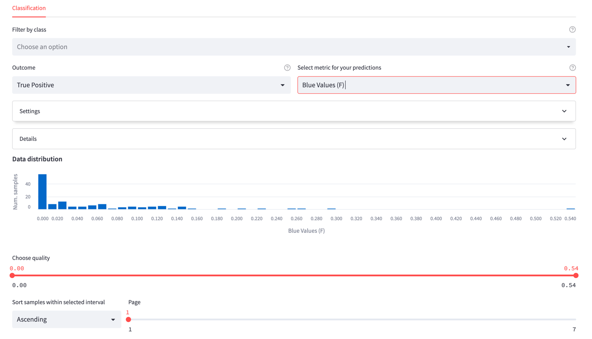

# Evaluating classification models

**Visualize the performance of your model**

Encord Active enables you to inspect classification performance metrics such as Accuracy, Precision, Recall, and F1
scores as well as a confusion matrix. Performance metrics can also be inspected according to different class
combinations. For this workflow, you need to [import your model predictions](../import/import-predictions.mdx)
into Encord Active.

`Prerequisites:` Dataset, Labels, Classification Predictions

#### Steps

1. Navigate to the _Model Quality_ > _Metrics_ tab on the left sidebar.
2. Under the **Classifications** tab, you will see the main performance metrics (accuracy, mean precision, mean recall,
   and mean F1 scores), metric importance graphs, confusion matrix, and class-based precision and recall plot.
3. You can filter by classes in the upper bar to see plots for your classes of interest.
4. Via the confusion matrix, you can detect which classes are confused with each other (uni-directional or bi-directional).
5. On the **Precision-Recall** plot, you can observe which classes the model has difficulty in and which classes it
   does well.
6. According to insights you get here, you can, e.g., prioritize from which classes you need to collect more data.

#### Example

The following is the model performance result for a Pokemon dataset (classes: _Charmander, Mewtwo, Pikachu,
Squirtle_)

## Finding Important Metrics

The three important metrics for this dataset are _Image-level Annotation Quality, Red Values_, and _Image Singularity_.
When
we look at their correlation, we see that as the Image-Level Annotation Quality increases, model performance increases,
too. On the other hand, Red Values and Image Singularity have a negative correlation with the model performance.

When we look at the confusion matrix, we find that most of the predictions are correct; Meanwhile, we can easily
observe that a significant part of the _charmader_ images was predicted as _pikachu_, resulting in low recall for the
_charmander_ and low precision for the _pikachu_ classes. So there might be value in investigating these wrongly labeled
charmander samples.

## Performance by Metric

Now, choose _Performance By Metric_ on the left sidebar. On this page, you can observe the **True-Positive Rate** as a
function of the chosen metric. You can
detect which regions model performs poorly or well, so that you can prioritize your next data collection and
labeling work accordingly. Classes can be filtered via global top bar for class-specific visualization. From the
image below, it can be seen that performance decreases when the image's redness property increases. So, we can
find similar images, like the ones where the model is failing, and annotate more of them to boost the performance in
this region.

## Exploring the Individual Samples

Using the explorer page, you can visualize the ranked images for specific outcomes (True
Positives, False Positives).

This page is very similar to the other explorer pages under _Data Quality_ and _Label Quality_ tabs; however, since you
have the prediction results now, the images can be filtered according to their outcome type. When the **True Positive**
outcome is selected, only the images that are predicted correctly will be shown; likewise, when the **False Positive**
outcome is selected, only the wrongly predicted images will be shown.

By inspecting False-Positive images, you can detect:

- where your model is failing.
- possible duplicate errors.
