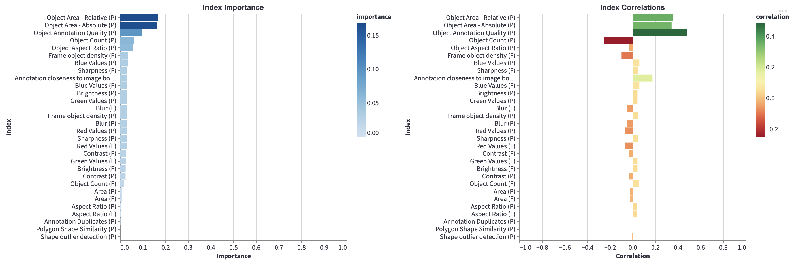
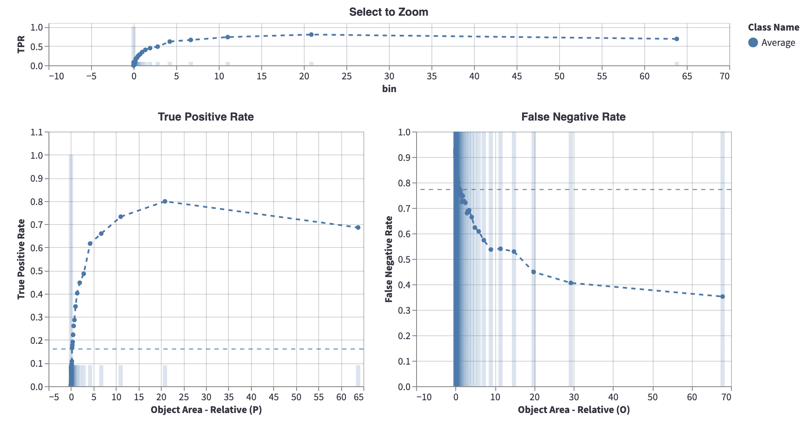
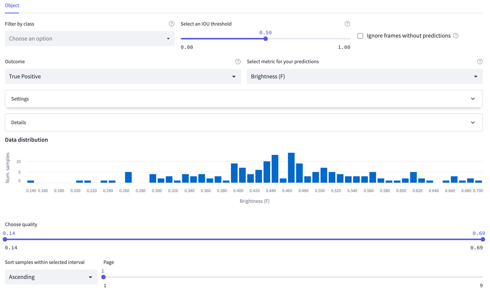

# Evaluating detection models

**Visualize the performance of your model**

Encord Active enables you to visualize the important performance metrics, such as mean Average-Precision (mAP), for your model.
Performance metrics can be visualized based on different classes and intersection-over-Union (IoU) thresholds.
Performance metrics are supported for bounding-boxes (object detection) and polygons (segmentation). For this workflow,
you need to [import your model predictions](../import/import-predictions) into Encord Active.

`Prerequisites:` Dataset, Labels, Object (bounding-box or polygon) Predictions

#### Steps

1. Navigate to the _Model Quality_ > _Metrics_ tab on the left sidebar.
2. Under the **Subset selection scores**, you will see the average precision (AP) and average recall (AR) for each class in the graph to the left
   and Precision-Recall curves for each class on the graph to the right.
3. You can select classes of interest and change the IoU threshold on the upper sidebar to customize plots.
4. On the **Mean scores** plot, you can observe in which classes the model has difficulty and in which classes it does well.
5. According to insights you get here, you can, e.g., prioritize from which classes you need to collect more data.

#### Example

Comparing **person** and **clock** objects.

The above figure shows that **clock** class degrades overall performance considerably. So, when
collecting and labeling more data, prioritizing it
over **person** class will make more sense for overall performance.

## Finding Important Metrics

**Visualize the relationship between your model performance and metrics**

With this workflow, you will be able to identify the most important [Quality Metrics](/category/quality-metrics) for
your model performance and prioritize further data exploration and actions.

`Prerequisites:` Dataset, Labels, Predictions

#### Steps:

1. Navigate to the _Model Quality_ > _Metrics_ tab.
2. Select label classes to include in the top left drop-down menu.
3. Determine the IoU threshold using the slider in the top bar. By default, IoU threshold is set to 0.50.
4. Next, Encord Active automatically computes mAP, mAR, Metric Importance, and Metric Correlation.

   **Metric importance**: Measures the _strength_ of the dependency between a metric and model
   performance. A high value means that the model performance would be strongly affected by
   a change in the metric. For example, high importance in 'Brightness' implies that a change
   in that quantity would strongly affect model performance. Values range from 0 (no dependency)
   to 1 (perfect dependency, one can completely predict model performance simply by looking
   at this metric).

   **Metric [correlation](https://en.wikipedia.org/wiki/Correlation)**: Measures the _linearity
   and direction_ of the dependency between a metric and model performance.
   Crucially, this metric tells us whether a positive change in a metric
   will lead to a positive change (positive correlation) or a negative change (negative correlation)
   in model performance. Values range from -1 to 1.

5. Metrics denoted with (P) are _Prediction-level metrics_ and metrics with (F) are _Frame-level metrics_.
6. Once an important metric is identified, navigate to _Performance By Metric_ in the _Model Quality_ tab.
7. Select the important metric you want to understand using the drop-down menu on the top bar.
8. By default, the performance chart is shown in aggregate for all classes: optionally, you can choose to decompose
   performance by class or select individual classes to be shown in the top left drop down menu.
9. The plot shows the _True Positive Rate_ (TPR) and the _False Negative Rate_ (FNR) by metric to help you identify
   which metric characteristics your model has a hard time predicting.

## Performance by Metric

Metric importance plots indicate that _Object Area - Relative (P)_ is an important metric that has an important relationship
with the model performance.

In this case, go to **Performance By Metric** page and choose "_Object Area - Relative (P)_" in the **Select metric for
your predictions** drop down menu.
Here, you can understand why _Object Area - Relative (P)_ has a relationship with the model performance, and you can
act based on insights you got from here.
Let's examine _Object Area - Relative (P)_ metric:

As indicated in the details, this metric refers to the object area as a percentage of the total image area.
The blue dashed horizontal line (around 0.17 TPR and 0.77 FNR) is the average true positive rate and false negative
rate of the selected classes, respectively.
So, what we get from the above graph is that objects, whose area is less than the 0.24%, have a very low performance.
In other words, the model predictions that are small are very often incorrect.
Similarly, labeled objects, for which the area is small, have a high false negative rate.

Based on this insight, you may improve your model with several actions, such as:

- Filtering model predictions to not include the smallest objects
- Increasing your model's input resolution
- Increasing the confidence threshold for small objects

## Exploring the Individual Samples

Using the explorer page, you can visualize the ranked images for specific outcomes (True
Positives, False Positives, False-Negatives).

#### Identifying False Positives

By selecting the false positive outcome in the top bar, you can quickly identify in which areas your model fails. With this
functionality you can, for example:

- Detect missing ground-truth labels
- Diagnose annotation errors
- Learn which classes your model confuses

and more, depending on your use cases.

1. Navigate to the _Model Quality_ > _Explorer_ tab on the left sidebar and choose **False Positive** as the Outcome in
   the top bar.
2. Visualize predictions and try to get insights on where model fails.
3. Under each image, an explanation is given for why the prediction is false positive. The three reasons are:
   - No overlapping with the ground-truth object. This means that there is no label with the same class as the predicted
     class which overlaps with the prediction.
   - IoU is too low. This means that the prediction does overlap with a label of the same class. However, the IoU
     between the prediction and the label is lower than the IoU threshold which is selected in the top bar.
   - Prediction with higher confidence is already matched with the ground-truth object.
     Since the mAP score chooses the prediction with the highest model confidence that has an IOU larger than the set
     threshold, other predictions that matched the label with a sufficiently high IOU will be considered false positives.
4. Note, that the boxed magenta object is the prediction, while the remaining objects are labels for the same
   image/frame.

#### Identifying False Negatives

Using the false negatives tab in Encord Active, you can quickly find out which objects the model misses.

1. Choose **False Positive** as the Outcome in the top bar.
2. Observe the ground-truth objects (purple boxed objects) that are missed by the model and get insights on where the
   model fails. The remaining objects in the image are the model predictions for that image.
