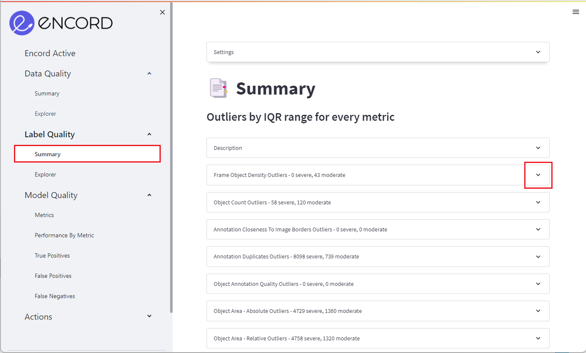
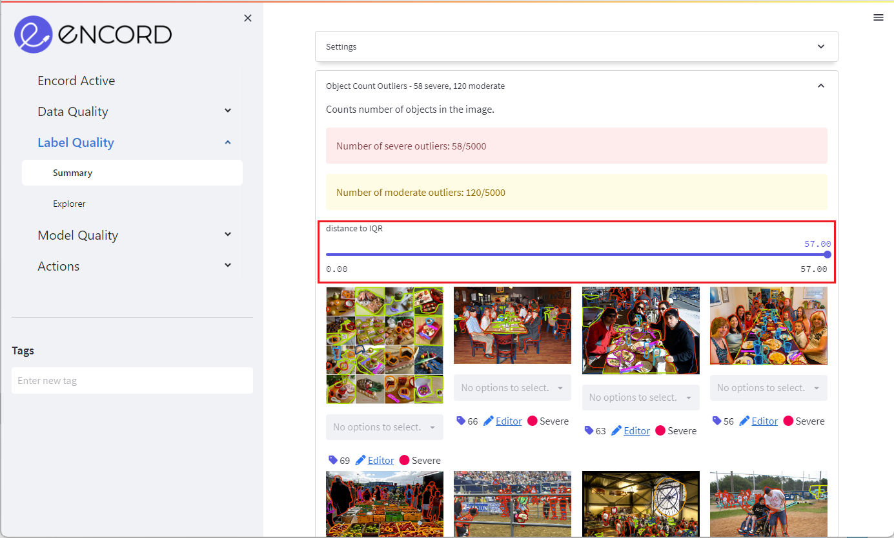
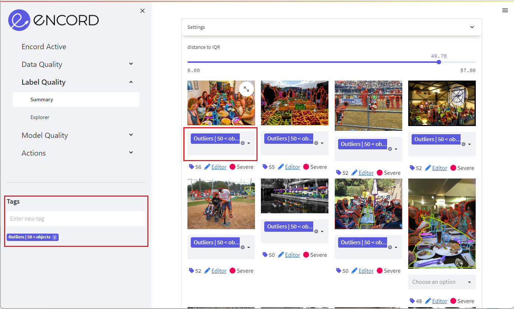
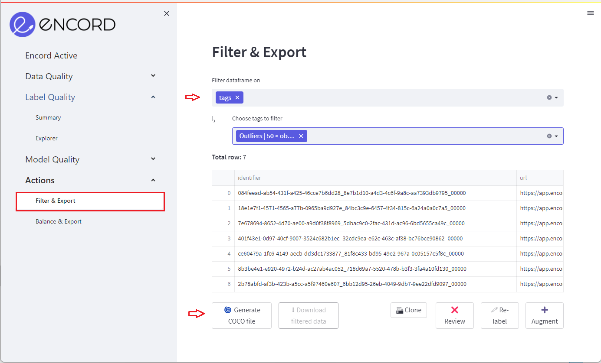

# Finding Outliers

**Use Encord Active to find label outliers in your dataset**

With Encord Active, you can quickly find image outliers for pre-defined metrics, custom metrics, and label classes.
Encord Active finds outliers using precomputed [Interquartile ranges](../../pages/data-quality/summary).

`Prerequisites:` Dataset & Labels

### Setup

If you haven't installed Encord Active, visit [installation](../../installation). In this workflow we will be using the COCO validation dataset.

### Steps

Navigate to the _Label Quality_ > _Summary_ tab. Here each [metric](/category/metrics) will be presented as an expandable panes.

You can click on a metric to get a deeper insight into _moderate outliers_ and _severe outliers_. Severe outliers are presented first in the pane.

Next, you can use the slider to navigate your data from most severe outlier to least severe.

When you have identified outliers of interest use the [tagging](../../workflows/tags) or [bulk tagging](../../workflows/tags) feature to select a group of images.
After creating a tagged image group, you can access it at the bottom of the left sidebar in the _Actions_ tab.

Within the _Actions_ tab, click _Filter data frame on_ and select _tags_. Next, choose the tags you would like to export, relabel, augment, review, or delete from your dataset.

