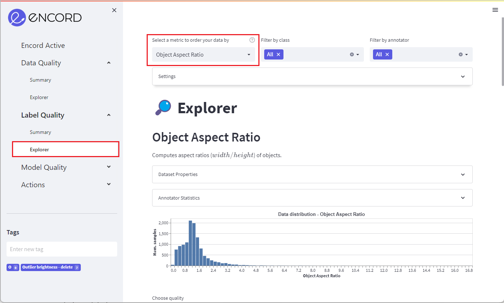
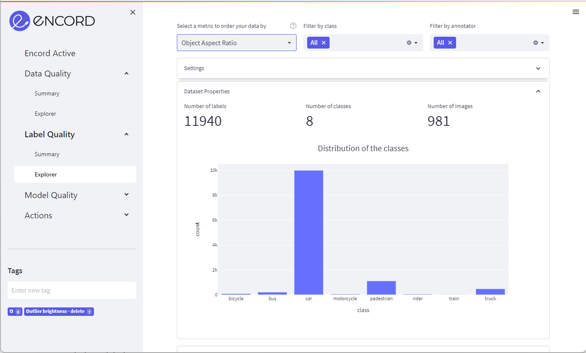
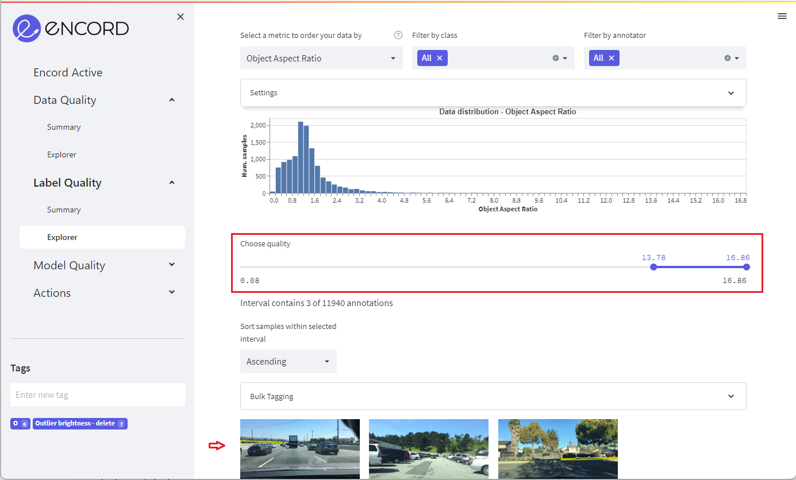

# Understanding Label Distribution

**Get insights into the distribution of your labels with Encord Active**

Encord Active enables you to visually explore your label distribution by pre-defined metrics, custom metrics, and label classes.
Understanding your label distribution by different metrics can help you discover gaps in your dataset to prioritise for further data collection and labelling to improve your models' performance.

`Prerequisites:` Dataset & Labels

:::tip

If you have uploaded your model predictions you can combine this workflow with [Find Important Metrics](../improve-your-models/metric-importance) to better prioritise what metrics to look at.

:::

## Setup

If you haven't installed Encord Active, visit [installation](../../installation). In this workflow we will be using the BDD validation dataset.

## Steps

Navigate to the _Label Quality_ > _Explorer_ tab and select a metric in the top left menu to order your data by.

Select a metric to order your data by in the dropdown menu in the top of the page (e.g., annotation count or object size).
[Optional] filter your data by class or by annotator using the middle and right dropdown menu.

You can use the dropdown menus to see your label distribution by class and annotator statistics.

In the dashboard you can see the distribution of your data according to the chosen metric.

Use the slider to navigate the dataset ordered by the chosen metric.

