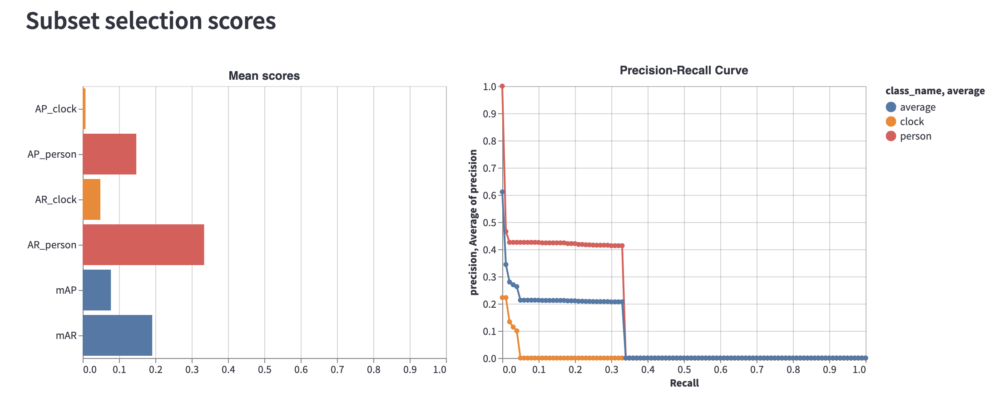

# Visualizing Performance Metrics

**Visualize performance of your model**

Encord Active enables you to visualize the important performance metrics, such as mean Average-Precision (mAP), for your model.
Performance metrics can be visualized based on different classes and intersection-over-Union (IoU) thresholds.
Performance metrics are supported for bounding-boxes (object detection) and polygons (segmentation).

`Prerequisites:` Dataset, Labels, Predictions

### Steps

1. Navigate to the _Model Quality_ > _Metrics_ tab on the left sidebar.
2. Under the **Subset selection scores**, you will see the average precision (AP) and average recall (AR) for each class in the graph to the left
   and Precision-Recall curves for each class on the graph to the right.
3. You can select classes of interest and change IoU threshold on the upper sidebar to customize plots.
4. On the **Mean scores** plot, you can observe in which classes the model has difficulty and in which classes it does well.
5. According to insights you get here, you can, e.g., prioritize from which classes you need to collect more data.

### Example

Comparing **person** and **clock** objects.

From the above figure, it is apparent that clock class degrades overall performance considerably. So, when collecting and labelling more data, prioritizing it
over person class will make more sense for overall performance.
