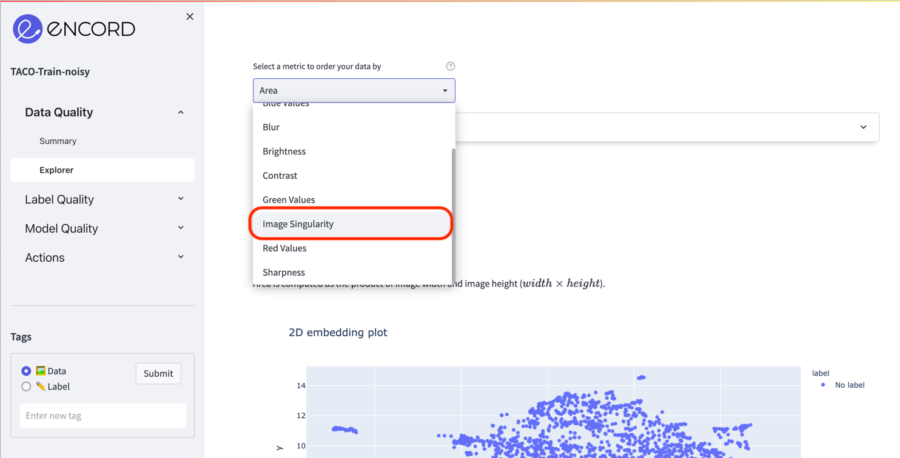
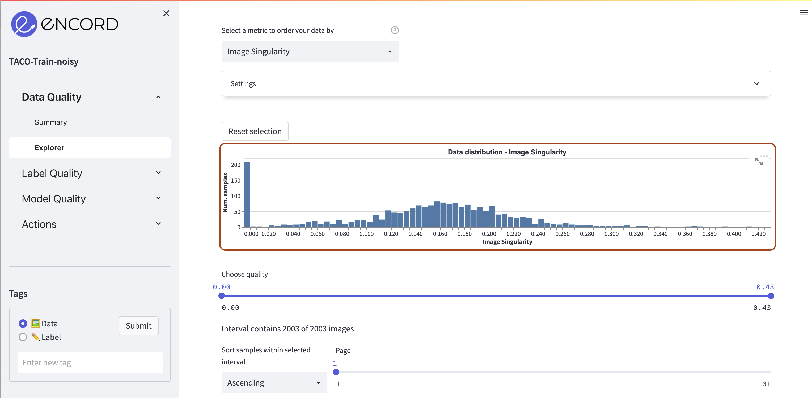
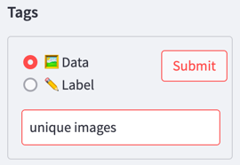
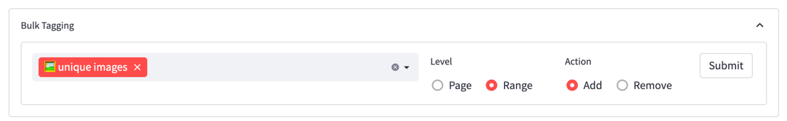
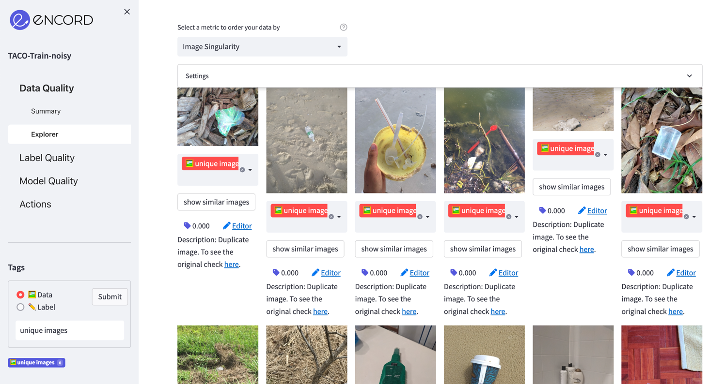
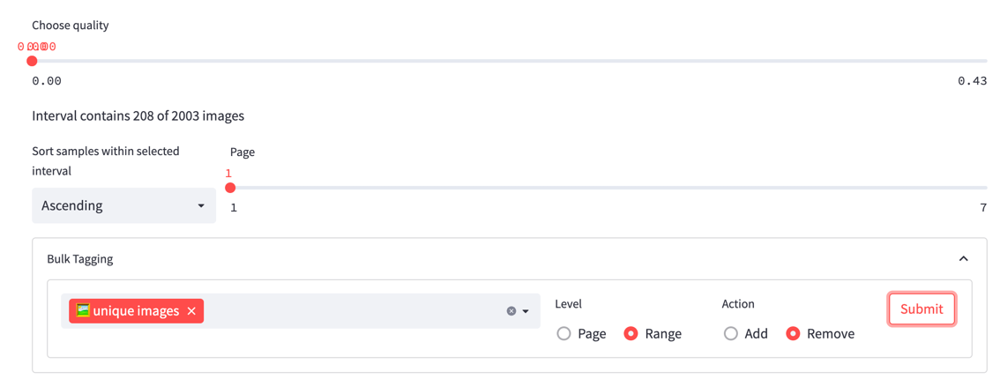
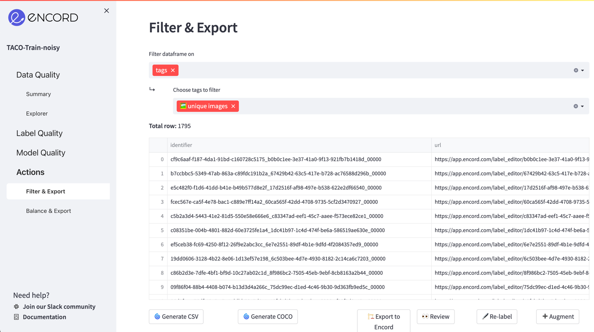
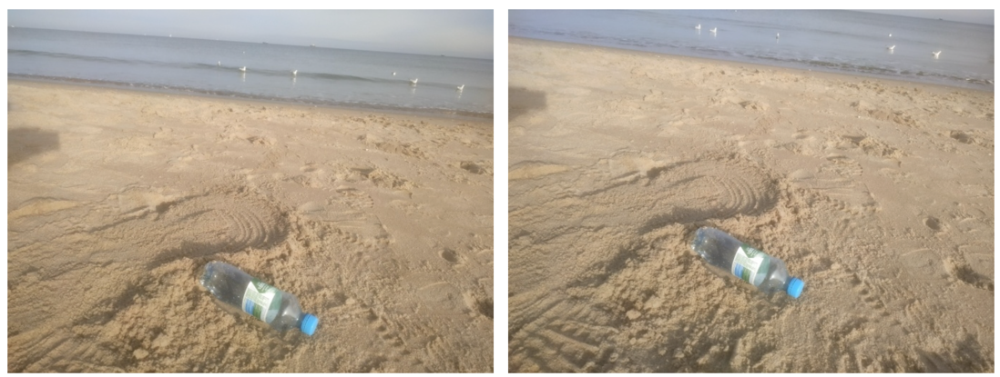
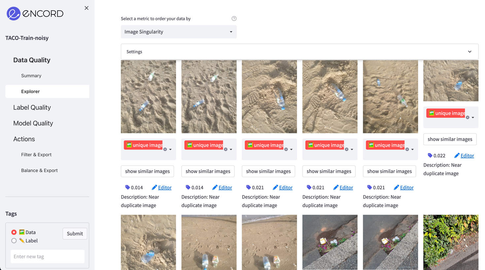

# Removing duplicate images

**Improve your dataset by detecting and removing duplicate and near-duplicate images**

Duplicate or near-duplicate images may cause bias in deep learning models. Encord-Active enables you to find and remove
duplicate and near duplicate images in your dataset so that you can remove them and improve the overall quality of the 
data. 

`Prerequisites:` Dataset

## Image singularity

This metric checks all your images in the dataset and assigns a score to them, which shows
their uniqueness.

- Uniqueness score is in the range of [0,1]. A higher value means a more unique image.
- A zero value indicates that this image has at least one identical image in this dataset. In the case of _N_ 
duplicate images, we assign a value of zero to _N-1_ of them (only one of them will have a nonzero value) so that they
can be excluded from the dataset immediately.
- In the case of duplicate images, _N-1_ images will be linked to a single image among those and this image can be 
visualized using the `Description` field under each image.
- Near duplicate images are labeled as `Near duplicate image` and shown side by side in the grid view. So that
you can choose which one to keep and which to remove.

## Steps
Navigate to the _Data Quality_ > _Explorer_  tab and select the **Image Singularity** quality metric in the top left 
dropdown to order your data. 

In the dashboard, you can see the distribution of your data according to the image singularity scores.

There are approximately 200 duplicate images in this example.

Scroll down to see the duplicate images. If you click the **show similar images** button, you should see at least
one image in the similar ones. If you have a project which is imported from [Encord Annotate](https://encord.com/), you can directly inspect the other image via
the link in the description.

Now, you want to remove all these duplicate images and improve the quality of our dataset. To do that, first we will 
create a tag and assign it to all images, then we will remove it from the ones with a zero value. 
Finally, we will use the **Actions** => **Filter & Export** tab to export
only the ones with the tag. Let's start.

Create a **data tag** in the **Tags** section on the left sidebar.

Go to **Bulk Tagging** section in the main view and assign the tag to all images. Select **Range** and 
**Add**.

When you click **Submit**, all images will be tagged with the tag you chose.

Now, move the right end of the slider to the value of zero so that we are only left with images that have a zero value.
Then, remove the assigned tags for this range, as shown below. When you click the **Submit** button, only the
images with non-zero values will be tagged, which is the subset that we want.

Go to **Actions** => **Filter & Export** and filter data according to the assigned tag.

Now for the resulting dataset, you can:
- Download it in CSV or COCO format to use in your own projects.
- Create a new Encord Active project.

### Removing near duplicate images

_An example of near duplicate image pairs detected with Encord Active_

Near duplicate images are the ones where one image is a slightly shifted/blurred/distorted version of the other. So, they
should also be removed from the dataset; however, this time you need to decide which sample gets to stay and which has to go. They
have scores slightly more than 0 and are shown side by side in the grid view, so it is easy to match them.

Move the right end of the **Choose quality** slider to somewhere around 0.05 so that we are only left with images with
a very low uniqueness score. Check the images that have _Near duplicate image_ in their description. Now you can remove the 
tag of the image that you want to be removed from your project and apply the same exporting steps.

