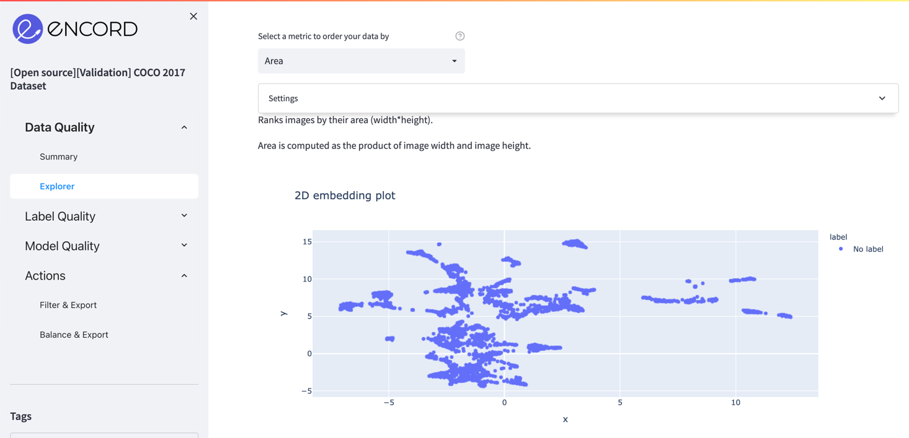
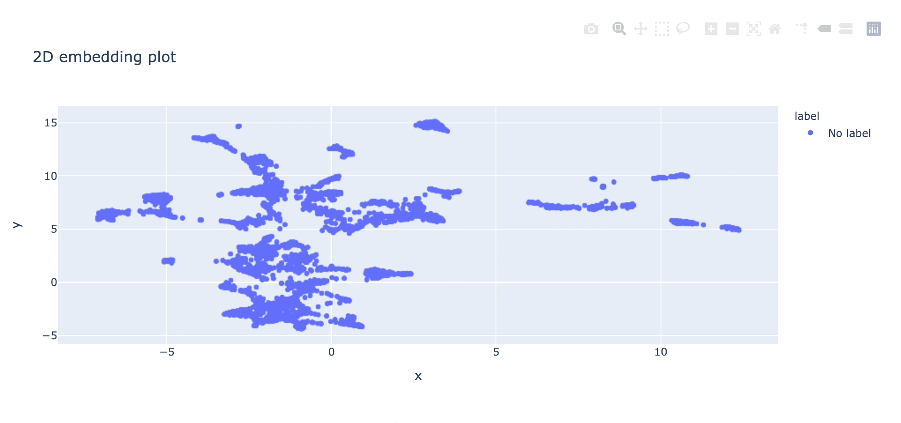
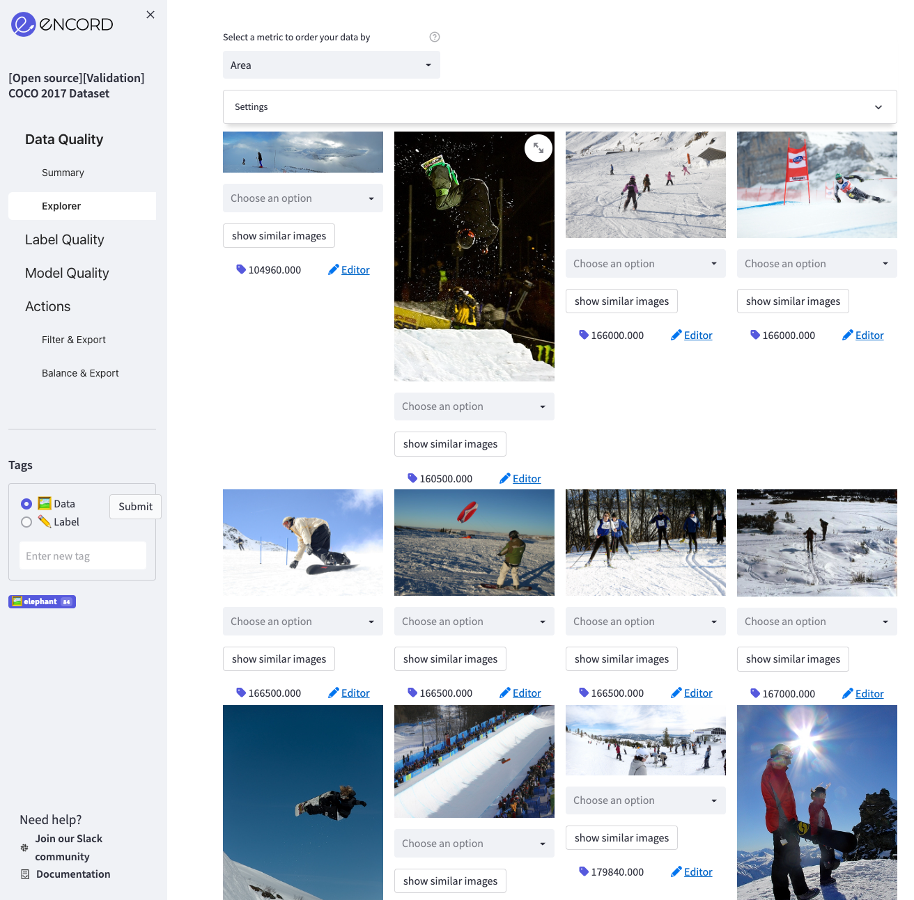
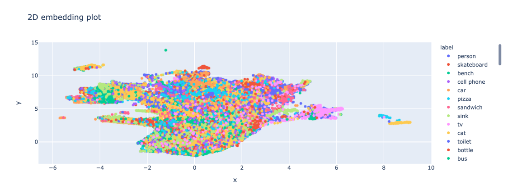

# Using 2D Embeddings

**Use 2D embeddings to improve your active learning cycle**

Encord Active presents you with a 2D embedding plot for all the images in your project. You can use it to find interesting
clusters, understand your data better, weakly label your images, remove detrimental images, etc. The 2D
embedding plot can be found in the **Explorer** pages of the **Data Quality** and **Label Quality** sections. Here is an example
embedding plot for the COCO 2017 validation set.

Notice how images are clustered around certain regions. In order to visualize images in these clusters and learn
what is common among these samples, you can use the _Box_ or _Lasso Select_ in the upper right corner of the plot.

Once you select a region, the rest of the app (data distribution plot and main grid view of images) will be updated
accordingly. Now you can only visualize the images in the selected region. For the above selection, the selected region has
snowy images.

Now you can perform several actions with the selected group:
- You can tag and export them in the **Actions** => **Filter & Export** page so that you can label these images
automatically via a script.
- You can explore the performance of the selected samples in the model performance page.
- You can create different subsets like these and compare them.

Samples in the 2D embedding plot in the **Data Quality => Summary** page have no label information; therefore, they all share
the same color. On the other hand, points colored according to labels on the **Label Quality => Summary** page.

Now you can:
- Check which classes are confused with each other
- Spot wrongly labeled samples (e.g., a different class inside the large cluster of another class)
- Detect outliers and remove them from the dataset
