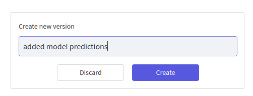

# Versioning

## Why?
When you do experiments and test hypotheses, you typically want to jump back and forth between different versions of your data, labels, and models. For example, when you train a model on a specific subset of your data, you will typically find that there is an edge case for which your model performs poorly. Hence, you expand your dataset with more data to better cover the edge case and train a new model.

In order to track your experiments and compare not only the model performance but also the underlying data shown to the model, you can use the project versioning feature of Encord Active.

## What?

The versioning is global for the project, so everything from what data and labels were available at a given point in time to what the model predictions were will be versioned and available.

Currently, versioning works like checkpoints, you can create a checkpoint and jump between them to view previous checkpoints.

## How?

#### Creating a new version

In order to create a new version, navigate to the Versioning page in the Actions menu item.

Provide a version name and click `create`.

:::tip

You also have the ability to discard any outstanding changes, i.e. everything after the last version.

:::

#### Viewing a previous version

On the left sidebar, there is a dropdown which allows version selection. Selecting an old version will temporary save any outstanding changes until the latest version is selected again.

:::warning

While on a previous version the app will be in read-only mode. Any changes made will be dicarded.

:::

